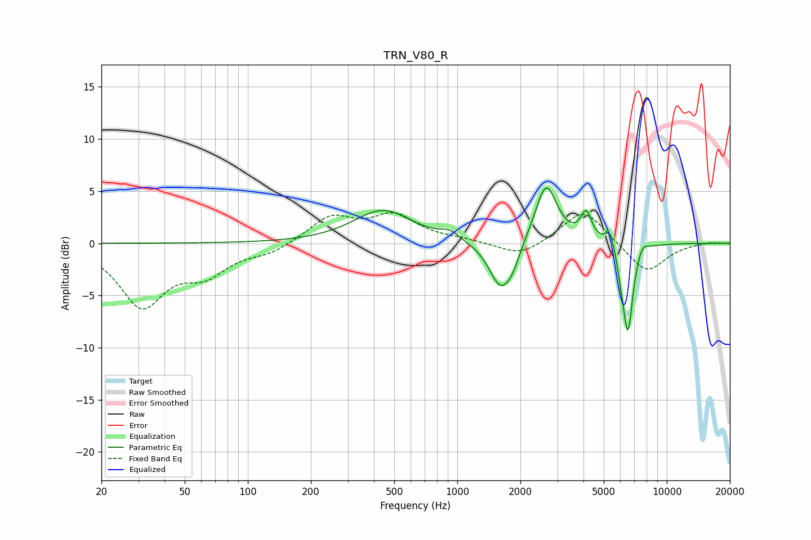

# TRN_V80_R
See [usage instructions](https://github.com/jaakkopasanen/AutoEq#usage) for more options and info.

### Parametric EQs
Apply preamp of -5.4 dB when using parametric equalizer.

|   # | Type    |   Fc (Hz) |    Q |   Gain (dB) |
|-----|---------|-----------|------|-------------|
|   1 | Peaking |       442 | 1.01 |         3.2 |
|   2 | Peaking |       920 | 3.26 |         0.7 |
|   3 | Peaking |      1609 | 2.55 |        -4.4 |
|   4 | Peaking |      1837 | 3.94 |        -1.3 |
|   5 | Peaking |      2651 | 2.7  |         5.8 |
|   6 | Peaking |      4123 | 5.44 |         2.6 |
|   7 | Peaking |      5362 | 6    |         1.9 |
|   8 | Peaking |      6080 | 6    |        -1.6 |
|   9 | Peaking |      6529 | 5.86 |        -8.1 |
|  10 | Peaking |      7672 | 5.78 |         0.8 |

### Fixed Band EQs
When using fixed band (also called graphic) equalizer, apply preamp of **-3.0 dB** (if available) and set gains manually with these parameters.

|   # | Type    |   Fc (Hz) |    Q |   Gain (dB) |
|-----|---------|-----------|------|-------------|
|   1 | Peaking |        31 | 1.41 |        -5.8 |
|   2 | Peaking |        62 | 1.41 |        -2.5 |
|   3 | Peaking |       125 | 1.41 |        -0.9 |
|   4 | Peaking |       250 | 1.41 |         2.5 |
|   5 | Peaking |       500 | 1.41 |         2.5 |
|   6 | Peaking |      1000 | 1.41 |         0.3 |
|   7 | Peaking |      2000 | 1.41 |        -1.4 |
|   8 | Peaking |      4000 | 1.41 |         3.4 |
|   9 | Peaking |      8000 | 1.41 |        -2.9 |
|  10 | Peaking |     16000 | 1.41 |         0.1 |

### Graphs

