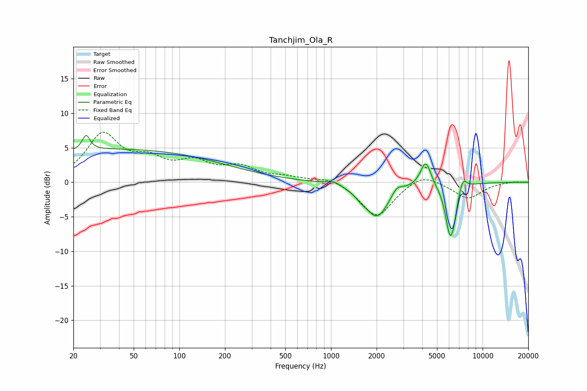

# Tanchjim_Ola_R
See [usage instructions](https://github.com/jaakkopasanen/AutoEq#usage) for more options and info.

### Parametric EQs
Apply preamp of -6.9 dB when using parametric equalizer.

|   # | Type    |   Fc (Hz) |    Q |   Gain (dB) |
|-----|---------|-----------|------|-------------|
|   1 | Peaking |        24 | 5.73 |         2.2 |
|   2 | Peaking |        38 | 0.18 |         4.8 |
|   3 | Peaking |      1044 | 3.45 |         0.5 |
|   4 | Peaking |      1575 | 3.18 |        -0.7 |
|   5 | Peaking |      2017 | 1.86 |        -4.9 |
|   6 | Peaking |      2722 | 4.2  |         1.1 |
|   7 | Peaking |      4213 | 4.15 |         3.6 |
|   8 | Peaking |      6093 | 4.33 |        -7.1 |
|   9 | Peaking |      6484 | 6    |        -1.7 |
|  10 | Peaking |      7398 | 5.34 |         1.8 |

### Fixed Band EQs
When using fixed band (also called graphic) equalizer, apply preamp of **-7.4 dB** (if available) and set gains manually with these parameters.

|   # | Type    |   Fc (Hz) |    Q |   Gain (dB) |
|-----|---------|-----------|------|-------------|
|   1 | Peaking |        31 | 1.41 |         6.7 |
|   2 | Peaking |        62 | 1.41 |         2.6 |
|   3 | Peaking |       125 | 1.41 |         2.5 |
|   4 | Peaking |       250 | 1.41 |         1.9 |
|   5 | Peaking |       500 | 1.41 |         0.6 |
|   6 | Peaking |      1000 | 1.41 |         0.8 |
|   7 | Peaking |      2000 | 1.41 |        -5.1 |
|   8 | Peaking |      4000 | 1.41 |         1.5 |
|   9 | Peaking |      8000 | 1.41 |        -2.4 |
|  10 | Peaking |     16000 | 1.41 |         0.1 |

### Graphs

