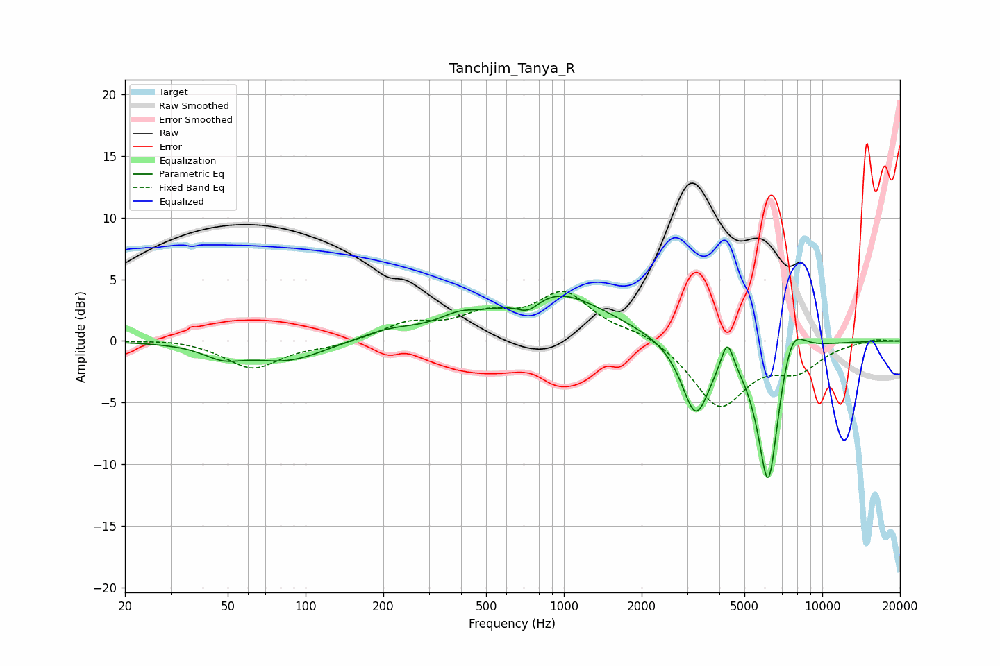

# Tanchjim_Tanya_R
See [usage instructions](https://github.com/jaakkopasanen/AutoEq#usage) for more options and info.

### Parametric EQs
Apply preamp of -3.7 dB when using parametric equalizer.

|   # | Type    |   Fc (Hz) |    Q |   Gain (dB) |
|-----|---------|-----------|------|-------------|
|   1 | Peaking |        48 | 1.87 |        -1   |
|   2 | Peaking |        85 | 0.98 |        -1.6 |
|   3 | Peaking |       210 | 1.21 |         0.8 |
|   4 | Peaking |       391 | 1.91 |         0.8 |
|   5 | Peaking |       727 | 2.92 |        -1.3 |
|   6 | Peaking |       902 | 0.68 |         4.1 |
|   7 | Peaking |      3237 | 2.6  |        -6   |
|   8 | Peaking |      4291 | 5.87 |         2.6 |
|   9 | Peaking |      6187 | 3.19 |       -12.3 |
|  10 | Peaking |      7572 | 2.64 |         3.4 |

### Fixed Band EQs
When using fixed band (also called graphic) equalizer, apply preamp of **-4.1 dB** (if available) and set gains manually with these parameters.

|   # | Type    |   Fc (Hz) |    Q |   Gain (dB) |
|-----|---------|-----------|------|-------------|
|   1 | Peaking |        31 | 1.41 |         0.2 |
|   2 | Peaking |        62 | 1.41 |        -2.2 |
|   3 | Peaking |       125 | 1.41 |        -0.4 |
|   4 | Peaking |       250 | 1.41 |         1.3 |
|   5 | Peaking |       500 | 1.41 |         1.8 |
|   6 | Peaking |      1000 | 1.41 |         3.7 |
|   7 | Peaking |      2000 | 1.41 |         0.7 |
|   8 | Peaking |      4000 | 1.41 |        -5.3 |
|   9 | Peaking |      8000 | 1.41 |        -2   |
|  10 | Peaking |     16000 | 1.41 |         0.2 |

### Graphs

