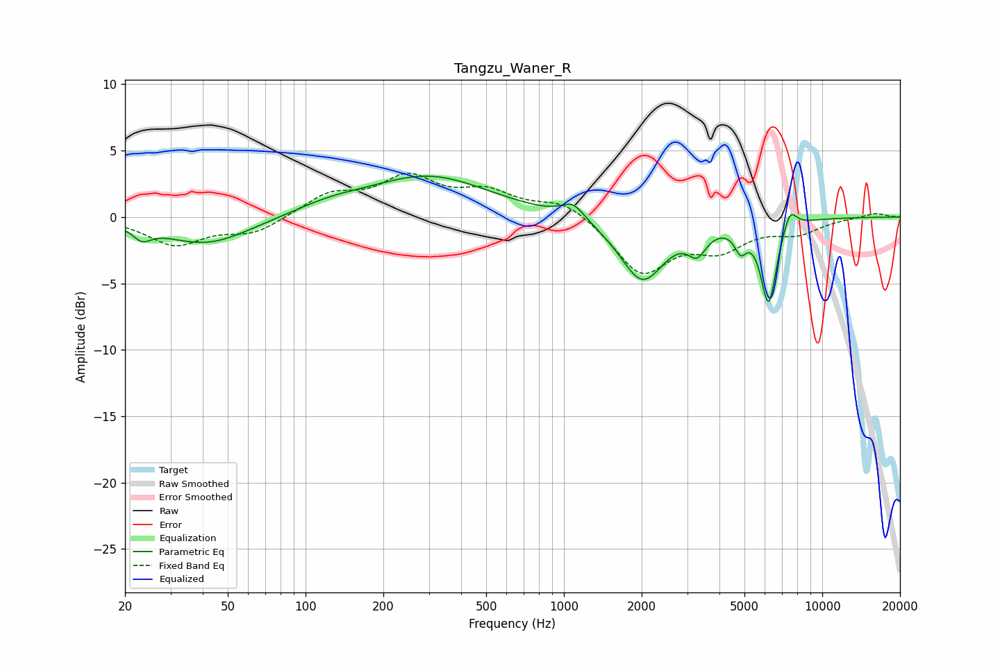

# Tangzu_Waner_R
See [usage instructions](https://github.com/jaakkopasanen/AutoEq#usage) for more options and info.

### Parametric EQs
Apply preamp of -3.2 dB when using parametric equalizer.

|   # | Type    |   Fc (Hz) |    Q |   Gain (dB) |
|-----|---------|-----------|------|-------------|
|   1 | Peaking |        23 | 4.24 |        -0.9 |
|   2 | Peaking |        41 | 0.84 |        -2.1 |
|   3 | Peaking |       124 | 0.99 |         0.7 |
|   4 | Peaking |       301 | 0.61 |         3   |
|   5 | Peaking |      1086 | 3.13 |         1.2 |
|   6 | Peaking |      2012 | 1.63 |        -4.8 |
|   7 | Peaking |      3280 | 3.93 |        -1.7 |
|   8 | Peaking |      4831 | 6    |        -1.6 |
|   9 | Peaking |      6200 | 4.5  |        -6.3 |
|  10 | Peaking |      7501 | 5.32 |         1.5 |

### Fixed Band EQs
When using fixed band (also called graphic) equalizer, apply preamp of **-3.4 dB** (if available) and set gains manually with these parameters.

|   # | Type    |   Fc (Hz) |    Q |   Gain (dB) |
|-----|---------|-----------|------|-------------|
|   1 | Peaking |        31 | 1.41 |        -2   |
|   2 | Peaking |        62 | 1.41 |        -1.2 |
|   3 | Peaking |       125 | 1.41 |         1.6 |
|   4 | Peaking |       250 | 1.41 |         2.8 |
|   5 | Peaking |       500 | 1.41 |         1.7 |
|   6 | Peaking |      1000 | 1.41 |         1.3 |
|   7 | Peaking |      2000 | 1.41 |        -4.2 |
|   8 | Peaking |      4000 | 1.41 |        -2.1 |
|   9 | Peaking |      8000 | 1.41 |        -1.1 |
|  10 | Peaking |     16000 | 1.41 |         0.3 |

### Graphs

