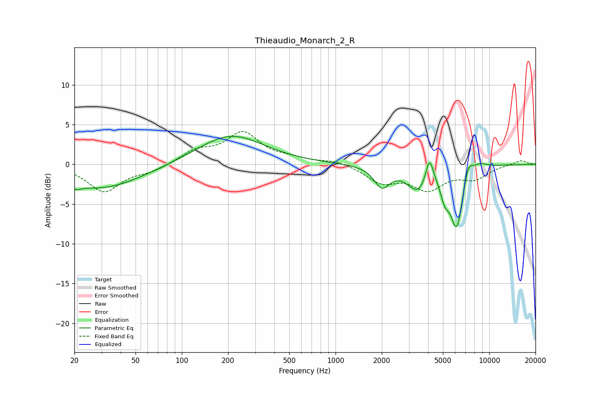

# Thieaudio_Monarch_2_R
See [usage instructions](https://github.com/jaakkopasanen/AutoEq#usage) for more options and info.

### Parametric EQs
Apply preamp of -3.6 dB when using parametric equalizer.

|   # | Type    |   Fc (Hz) |    Q |   Gain (dB) |
|-----|---------|-----------|------|-------------|
|   1 | Peaking |        21 | 4.98 |        -0.5 |
|   2 | Peaking |        29 | 0.52 |        -3.1 |
|   3 | Peaking |       208 | 0.66 |         3.7 |
|   4 | Peaking |      2003 | 2.81 |        -2.5 |
|   5 | Peaking |      3462 | 1.96 |        -3.1 |
|   6 | Peaking |      4089 | 5.44 |         3.5 |
|   7 | Peaking |      5150 | 4.91 |        -2.3 |
|   8 | Peaking |      6156 | 3.28 |        -7.7 |
|   9 | Peaking |      7283 | 4.38 |         2.3 |
|  10 | Peaking |      8697 | 2.74 |         0.7 |

### Fixed Band EQs
When using fixed band (also called graphic) equalizer, apply preamp of **-4.2 dB** (if available) and set gains manually with these parameters.

|   # | Type    |   Fc (Hz) |    Q |   Gain (dB) |
|-----|---------|-----------|------|-------------|
|   1 | Peaking |        31 | 1.41 |        -3.4 |
|   2 | Peaking |        62 | 1.41 |        -0.8 |
|   3 | Peaking |       125 | 1.41 |         1.6 |
|   4 | Peaking |       250 | 1.41 |         3.8 |
|   5 | Peaking |       500 | 1.41 |         0.5 |
|   6 | Peaking |      1000 | 1.41 |         0.5 |
|   7 | Peaking |      2000 | 1.41 |        -2.1 |
|   8 | Peaking |      4000 | 1.41 |        -2.9 |
|   9 | Peaking |      8000 | 1.41 |        -1.6 |
|  10 | Peaking |     16000 | 1.41 |         0.5 |

### Graphs

