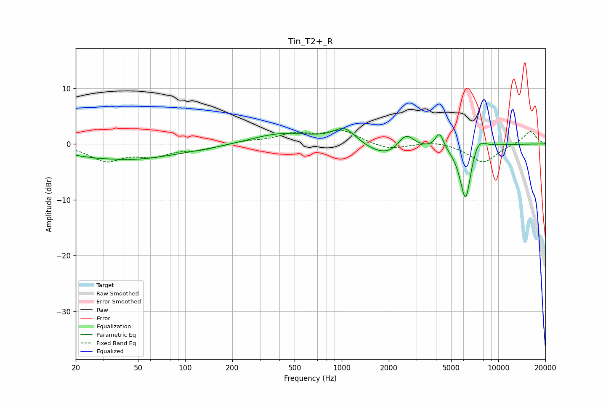

# Tin_T2+_R
See [usage instructions](https://github.com/jaakkopasanen/AutoEq#usage) for more options and info.

### Parametric EQs
Apply preamp of -2.9 dB when using parametric equalizer.

|   # | Type    |   Fc (Hz) |    Q |   Gain (dB) |
|-----|---------|-----------|------|-------------|
|   1 | Peaking |        35 | 1.97 |         0.1 |
|   2 | Peaking |        37 | 0.46 |        -2.1 |
|   3 | Peaking |       103 | 0.18 |        -0.9 |
|   4 | Peaking |       413 | 0.62 |         2.5 |
|   5 | Peaking |      1044 | 1.98 |         2.8 |
|   6 | Peaking |      1989 | 1.04 |        -2.7 |
|   7 | Peaking |      2571 | 2.63 |         3.2 |
|   8 | Peaking |      4215 | 5.38 |         2.8 |
|   9 | Peaking |      6186 | 3.65 |       -10.7 |
|  10 | Peaking |      7365 | 2.82 |         2.8 |

### Fixed Band EQs
When using fixed band (also called graphic) equalizer, apply preamp of **-2.5 dB** (if available) and set gains manually with these parameters.

|   # | Type    |   Fc (Hz) |    Q |   Gain (dB) |
|-----|---------|-----------|------|-------------|
|   1 | Peaking |        31 | 1.41 |        -2.8 |
|   2 | Peaking |        62 | 1.41 |        -1.8 |
|   3 | Peaking |       125 | 1.41 |        -0.9 |
|   4 | Peaking |       250 | 1.41 |         0.5 |
|   5 | Peaking |       500 | 1.41 |         1.7 |
|   6 | Peaking |      1000 | 1.41 |         2.3 |
|   7 | Peaking |      2000 | 1.41 |        -1.1 |
|   8 | Peaking |      4000 | 1.41 |         0.6 |
|   9 | Peaking |      8000 | 1.41 |        -3.4 |
|  10 | Peaking |     16000 | 1.41 |         2.4 |

### Graphs

