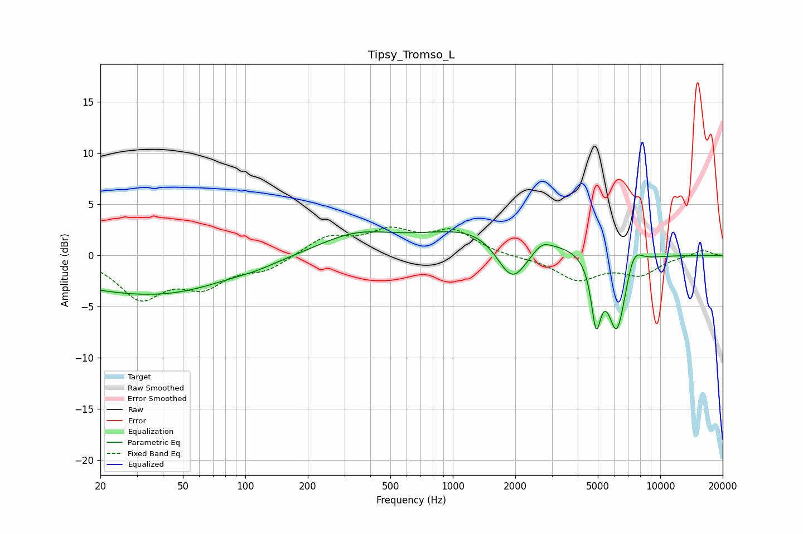

# Tipsy_Tromso_L
See [usage instructions](https://github.com/jaakkopasanen/AutoEq#usage) for more options and info.

### Parametric EQs
Apply preamp of -2.4 dB when using parametric equalizer.

|   # | Type    |   Fc (Hz) |    Q |   Gain (dB) |
|-----|---------|-----------|------|-------------|
|   1 | Peaking |        21 | 0.38 |        -2.7 |
|   2 | Peaking |        54 | 0.52 |        -1.8 |
|   3 | Peaking |       114 | 1.54 |        -0.3 |
|   4 | Peaking |       340 | 0.77 |         1.9 |
|   5 | Peaking |      1629 | 0.48 |         3.3 |
|   6 | Peaking |      1937 | 1.76 |        -5.1 |
|   7 | Peaking |      2692 | 3.59 |         0.7 |
|   8 | Peaking |      4906 | 5.96 |        -6   |
|   9 | Peaking |      6182 | 3.05 |        -7.8 |
|  10 | Peaking |      7453 | 3.51 |         2.2 |

### Fixed Band EQs
When using fixed band (also called graphic) equalizer, apply preamp of **-2.9 dB** (if available) and set gains manually with these parameters.

|   # | Type    |   Fc (Hz) |    Q |   Gain (dB) |
|-----|---------|-----------|------|-------------|
|   1 | Peaking |        31 | 1.41 |        -3.9 |
|   2 | Peaking |        62 | 1.41 |        -2.6 |
|   3 | Peaking |       125 | 1.41 |        -1.3 |
|   4 | Peaking |       250 | 1.41 |         1.8 |
|   5 | Peaking |       500 | 1.41 |         2.1 |
|   6 | Peaking |      1000 | 1.41 |         2.3 |
|   7 | Peaking |      2000 | 1.41 |        -0.1 |
|   8 | Peaking |      4000 | 1.41 |        -2.3 |
|   9 | Peaking |      8000 | 1.41 |        -1.7 |
|  10 | Peaking |     16000 | 1.41 |         0.6 |

### Graphs

