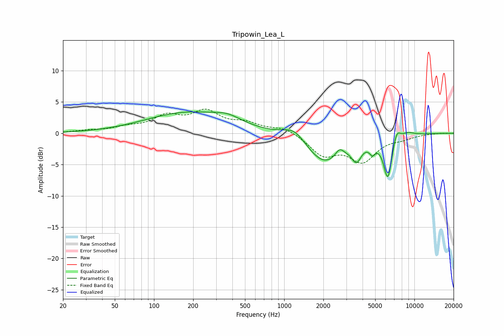

# Tripowin_Lea_L
See [usage instructions](https://github.com/jaakkopasanen/AutoEq#usage) for more options and info.

### Parametric EQs
Apply preamp of -3.5 dB when using parametric equalizer.

|   # | Type    |   Fc (Hz) |    Q |   Gain (dB) |
|-----|---------|-----------|------|-------------|
|   1 | Peaking |       181 | 0.44 |         3.2 |
|   2 | Peaking |       367 | 1.45 |         1   |
|   3 | Peaking |      1201 | 1.61 |         2.1 |
|   4 | Peaking |      2035 | 0.95 |        -5   |
|   5 | Peaking |      2661 | 4.17 |         1.4 |
|   6 | Peaking |      3591 | 3.89 |        -2.6 |
|   7 | Peaking |      4760 | 6    |        -1.4 |
|   8 | Peaking |      6249 | 4.15 |        -6.8 |
|   9 | Peaking |      7306 | 4.85 |         2   |
|  10 | Peaking |      8928 | 2.77 |         0.6 |

### Fixed Band EQs
When using fixed band (also called graphic) equalizer, apply preamp of **-4.0 dB** (if available) and set gains manually with these parameters.

|   # | Type    |   Fc (Hz) |    Q |   Gain (dB) |
|-----|---------|-----------|------|-------------|
|   1 | Peaking |        31 | 1.41 |         0.3 |
|   2 | Peaking |        62 | 1.41 |         0.8 |
|   3 | Peaking |       125 | 1.41 |         2.4 |
|   4 | Peaking |       250 | 1.41 |         3.1 |
|   5 | Peaking |       500 | 1.41 |         1.4 |
|   6 | Peaking |      1000 | 1.41 |         1   |
|   7 | Peaking |      2000 | 1.41 |        -3.3 |
|   8 | Peaking |      4000 | 1.41 |        -4.2 |
|   9 | Peaking |      8000 | 1.41 |        -0.6 |
|  10 | Peaking |     16000 | 1.41 |         0.1 |

### Graphs

