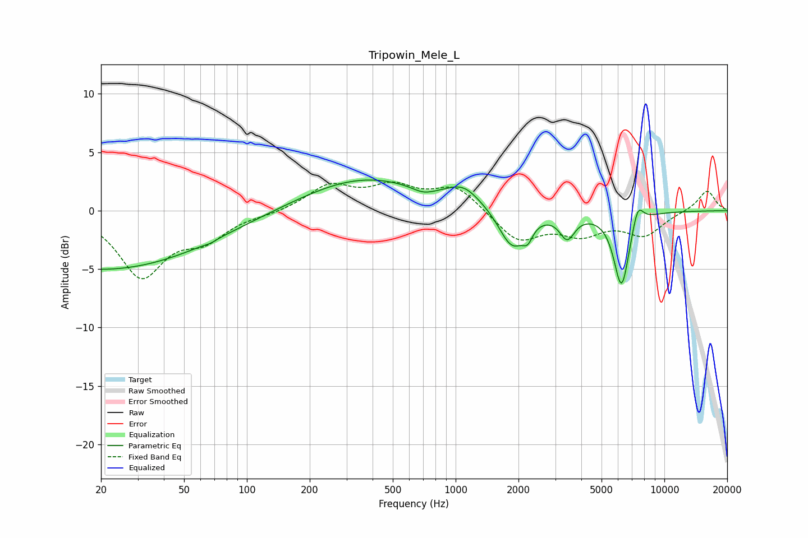

# Tripowin_Mele_L
See [usage instructions](https://github.com/jaakkopasanen/AutoEq#usage) for more options and info.

### Parametric EQs
Apply preamp of -2.7 dB when using parametric equalizer.

|   # | Type    |   Fc (Hz) |    Q |   Gain (dB) |
|-----|---------|-----------|------|-------------|
|   1 | Peaking |        20 | 0.27 |        -5.1 |
|   2 | Peaking |        67 | 5.68 |        -0.1 |
|   3 | Peaking |       364 | 0.48 |         2.8 |
|   4 | Peaking |       701 | 2.6  |        -0.5 |
|   5 | Peaking |      1093 | 1.78 |         1.5 |
|   6 | Peaking |      1861 | 2.25 |        -3.3 |
|   7 | Peaking |      2214 | 5.96 |        -1.1 |
|   8 | Peaking |      3425 | 3.92 |        -2.1 |
|   9 | Peaking |      6238 | 3.67 |        -6.4 |
|  10 | Peaking |      7459 | 5.15 |         1.8 |

### Fixed Band EQs
When using fixed band (also called graphic) equalizer, apply preamp of **-2.6 dB** (if available) and set gains manually with these parameters.

|   # | Type    |   Fc (Hz) |    Q |   Gain (dB) |
|-----|---------|-----------|------|-------------|
|   1 | Peaking |        31 | 1.41 |        -5.4 |
|   2 | Peaking |        62 | 1.41 |        -2.1 |
|   3 | Peaking |       125 | 1.41 |        -0.2 |
|   4 | Peaking |       250 | 1.41 |         2.1 |
|   5 | Peaking |       500 | 1.41 |         1.8 |
|   6 | Peaking |      1000 | 1.41 |         2.1 |
|   7 | Peaking |      2000 | 1.41 |        -2.6 |
|   8 | Peaking |      4000 | 1.41 |        -1.8 |
|   9 | Peaking |      8000 | 1.41 |        -2   |
|  10 | Peaking |     16000 | 1.41 |         1.8 |

### Graphs

