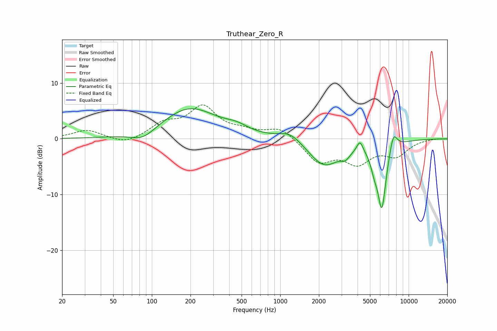

# Truthear_Zero_R
See [usage instructions](https://github.com/jaakkopasanen/AutoEq#usage) for more options and info.

### Parametric EQs
Apply preamp of -5.5 dB when using parametric equalizer.

|   # | Type    |   Fc (Hz) |    Q |   Gain (dB) |
|-----|---------|-----------|------|-------------|
|   1 | Peaking |        85 | 1.49 |        -1.8 |
|   2 | Peaking |       197 | 0.65 |         5.5 |
|   3 | Peaking |       459 | 1.64 |         1   |
|   4 | Peaking |      1196 | 1.61 |         1.7 |
|   5 | Peaking |      2204 | 1.16 |        -4.8 |
|   6 | Peaking |      3218 | 4.04 |        -1.2 |
|   7 | Peaking |      4174 | 6    |         2   |
|   8 | Peaking |      5392 | 5.22 |        -2.1 |
|   9 | Peaking |      6181 | 3.93 |       -12   |
|  10 | Peaking |      7604 | 4.55 |         3.3 |

### Fixed Band EQs
When using fixed band (also called graphic) equalizer, apply preamp of **-6.2 dB** (if available) and set gains manually with these parameters.

|   # | Type    |   Fc (Hz) |    Q |   Gain (dB) |
|-----|---------|-----------|------|-------------|
|   1 | Peaking |        31 | 1.41 |         1.6 |
|   2 | Peaking |        62 | 1.41 |        -1.1 |
|   3 | Peaking |       125 | 1.41 |         2.4 |
|   4 | Peaking |       250 | 1.41 |         5.4 |
|   5 | Peaking |       500 | 1.41 |         1   |
|   6 | Peaking |      1000 | 1.41 |         2.1 |
|   7 | Peaking |      2000 | 1.41 |        -4   |
|   8 | Peaking |      4000 | 1.41 |        -3.9 |
|   9 | Peaking |      8000 | 1.41 |        -2.7 |
|  10 | Peaking |     16000 | 1.41 |         0.1 |

### Graphs

