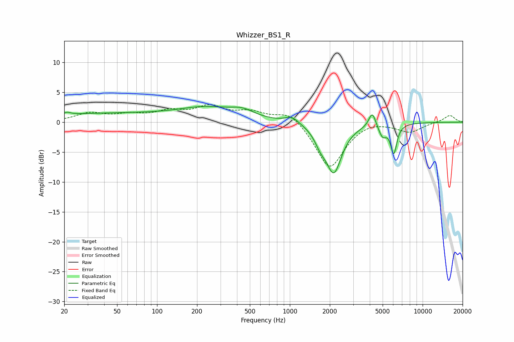

# Whizzer_BS1_R
See [usage instructions](https://github.com/jaakkopasanen/AutoEq#usage) for more options and info.

### Parametric EQs
Apply preamp of -2.7 dB when using parametric equalizer.

|   # | Type    |   Fc (Hz) |    Q |   Gain (dB) |
|-----|---------|-----------|------|-------------|
|   1 | Peaking |        21 | 5.75 |         0.4 |
|   2 | Peaking |        40 | 0.26 |         1.4 |
|   3 | Peaking |       238 | 0.67 |         2   |
|   4 | Peaking |       439 | 1.58 |         1.2 |
|   5 | Peaking |      1037 | 2.79 |         1.1 |
|   6 | Peaking |      1697 | 3.39 |        -1.8 |
|   7 | Peaking |      2145 | 2.35 |        -8.1 |
|   8 | Peaking |      4178 | 5.48 |         2.6 |
|   9 | Peaking |      4990 | 4.81 |        -2   |
|  10 | Peaking |      6061 | 6    |        -4.8 |

### Fixed Band EQs
When using fixed band (also called graphic) equalizer, apply preamp of **-3.1 dB** (if available) and set gains manually with these parameters.

|   # | Type    |   Fc (Hz) |    Q |   Gain (dB) |
|-----|---------|-----------|------|-------------|
|   1 | Peaking |        31 | 1.41 |         1.4 |
|   2 | Peaking |        62 | 1.41 |         1   |
|   3 | Peaking |       125 | 1.41 |         1.5 |
|   4 | Peaking |       250 | 1.41 |         2.4 |
|   5 | Peaking |       500 | 1.41 |         1.5 |
|   6 | Peaking |      1000 | 1.41 |         2   |
|   7 | Peaking |      2000 | 1.41 |        -7.8 |
|   8 | Peaking |      4000 | 1.41 |         0.6 |
|   9 | Peaking |      8000 | 1.41 |        -1.6 |
|  10 | Peaking |     16000 | 1.41 |         1.2 |

### Graphs

