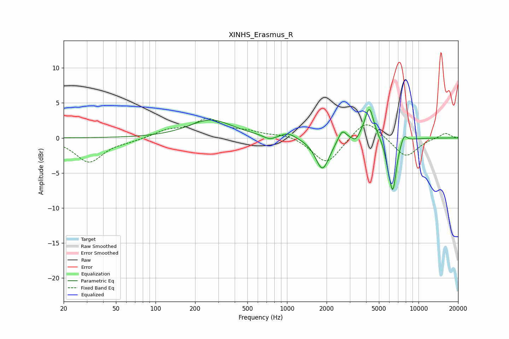

# XINHS_Erasmus_R
See [usage instructions](https://github.com/jaakkopasanen/AutoEq#usage) for more options and info.

### Parametric EQs
Apply preamp of -4.2 dB when using parametric equalizer.

|   # | Type    |   Fc (Hz) |    Q |   Gain (dB) |
|-----|---------|-----------|------|-------------|
|   1 | Peaking |       263 | 0.86 |         2.6 |
|   2 | Peaking |       738 | 3.08 |        -0.6 |
|   3 | Peaking |      1022 | 2.62 |         0.7 |
|   4 | Peaking |      1859 | 2.71 |        -4.6 |
|   5 | Peaking |      2628 | 4.67 |         1.6 |
|   6 | Peaking |      3316 | 6    |        -0.8 |
|   7 | Peaking |      4225 | 4.1  |         4.6 |
|   8 | Peaking |      5875 | 6    |        -1.7 |
|   9 | Peaking |      6389 | 5.07 |        -7   |
|  10 | Peaking |      7757 | 5.75 |         1.2 |

### Fixed Band EQs
When using fixed band (also called graphic) equalizer, apply preamp of **-2.9 dB** (if available) and set gains manually with these parameters.

|   # | Type    |   Fc (Hz) |    Q |   Gain (dB) |
|-----|---------|-----------|------|-------------|
|   1 | Peaking |        31 | 1.41 |        -3.4 |
|   2 | Peaking |        62 | 1.41 |        -0.3 |
|   3 | Peaking |       125 | 1.41 |         1   |
|   4 | Peaking |       250 | 1.41 |         2.5 |
|   5 | Peaking |       500 | 1.41 |         0.7 |
|   6 | Peaking |      1000 | 1.41 |         0.6 |
|   7 | Peaking |      2000 | 1.41 |        -3.8 |
|   8 | Peaking |      4000 | 1.41 |         2.9 |
|   9 | Peaking |      8000 | 1.41 |        -2.8 |
|  10 | Peaking |     16000 | 1.41 |         0.8 |

### Graphs

