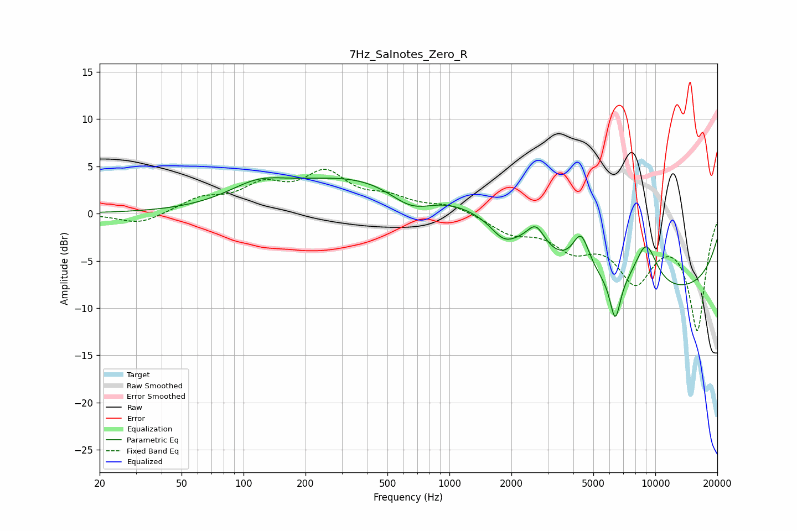

# 7Hz_Salnotes_Zero_R
See [usage instructions](https://github.com/jaakkopasanen/AutoEq#usage) for more options and info.

### Parametric EQs
Apply preamp of -3.9 dB when using parametric equalizer.

|   # | Type    |   Fc (Hz) |    Q |   Gain (dB) |
|-----|---------|-----------|------|-------------|
|   1 | Peaking |       116 | 0.99 |         1.9 |
|   2 | Peaking |       511 | 0.3  |         4.6 |
|   3 | Peaking |       654 | 1.19 |        -2.8 |
|   4 | Peaking |      1747 | 2.69 |        -0.6 |
|   5 | Peaking |      1881 | 2.72 |        -0.9 |
|   6 | Peaking |      2631 | 3.17 |         2.5 |
|   7 | Peaking |      4360 | 3.38 |         3.9 |
|   8 | Peaking |      6388 | 5.33 |        -4.6 |
|   9 | Peaking |      9013 | 2.25 |         4.9 |
|  10 | Peaking |      9691 | 0.19 |        -8.5 |

### Fixed Band EQs
When using fixed band (also called graphic) equalizer, apply preamp of **-4.8 dB** (if available) and set gains manually with these parameters.

|   # | Type    |   Fc (Hz) |    Q |   Gain (dB) |
|-----|---------|-----------|------|-------------|
|   1 | Peaking |        31 | 1.41 |        -1.2 |
|   2 | Peaking |        62 | 1.41 |         1.4 |
|   3 | Peaking |       125 | 1.41 |         2.6 |
|   4 | Peaking |       250 | 1.41 |         3.9 |
|   5 | Peaking |       500 | 1.41 |         1.4 |
|   6 | Peaking |      1000 | 1.41 |         0.9 |
|   7 | Peaking |      2000 | 1.41 |        -1.8 |
|   8 | Peaking |      4000 | 1.41 |        -3.1 |
|   9 | Peaking |      8000 | 1.41 |        -6.4 |
|  10 | Peaking |     16000 | 1.41 |       -12.1 |

### Graphs

