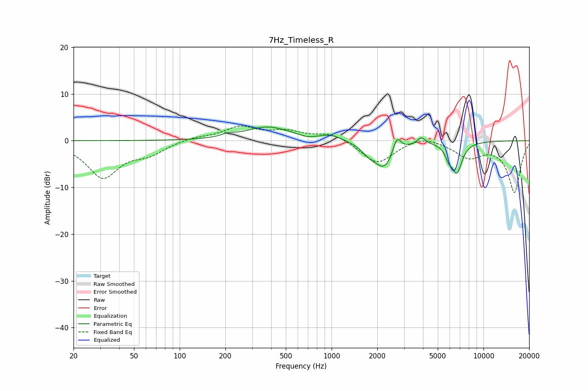

# 7Hz_Timeless_R
See [usage instructions](https://github.com/jaakkopasanen/AutoEq#usage) for more options and info.

### Parametric EQs
Apply preamp of -3.0 dB when using parametric equalizer.

|   # | Type    |   Fc (Hz) |    Q |   Gain (dB) |
|-----|---------|-----------|------|-------------|
|   1 | Peaking |       209 | 3.39 |         0.6 |
|   2 | Peaking |       380 | 0.97 |         2.9 |
|   3 | Peaking |       691 | 3.39 |        -0.4 |
|   4 | Peaking |      1002 | 2.03 |         1.1 |
|   5 | Peaking |      1769 | 2.97 |        -1.5 |
|   6 | Peaking |      2237 | 2.12 |        -5.7 |
|   7 | Peaking |      2688 | 5.21 |         3.7 |
|   8 | Peaking |      3899 | 5.26 |         1.5 |
|   9 | Peaking |      5910 | 6    |        -2.1 |
|  10 | Peaking |      6685 | 3.96 |        -6.3 |

### Fixed Band EQs
When using fixed band (also called graphic) equalizer, apply preamp of **-3.2 dB** (if available) and set gains manually with these parameters.

|   # | Type    |   Fc (Hz) |    Q |   Gain (dB) |
|-----|---------|-----------|------|-------------|
|   1 | Peaking |        31 | 1.41 |        -7.7 |
|   2 | Peaking |        62 | 1.41 |        -2.3 |
|   3 | Peaking |       125 | 1.41 |         0.8 |
|   4 | Peaking |       250 | 1.41 |         2.8 |
|   5 | Peaking |       500 | 1.41 |         1.8 |
|   6 | Peaking |      1000 | 1.41 |         1.7 |
|   7 | Peaking |      2000 | 1.41 |        -5   |
|   8 | Peaking |      4000 | 1.41 |         1.3 |
|   9 | Peaking |      8000 | 1.41 |        -3.3 |
|  10 | Peaking |     16000 | 1.41 |       -11   |

### Graphs

