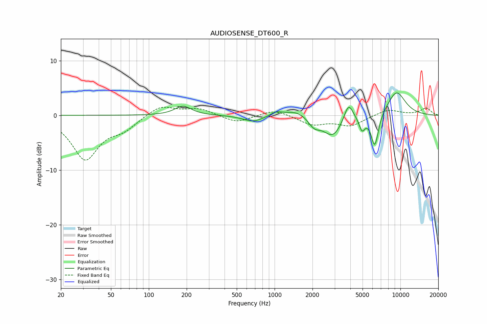

# AUDIOSENSE_DT600_R
See [usage instructions](https://github.com/jaakkopasanen/AutoEq#usage) for more options and info.

### Parametric EQs
Apply preamp of -4.2 dB when using parametric equalizer.

|   # | Type    |   Fc (Hz) |    Q |   Gain (dB) |
|-----|---------|-----------|------|-------------|
|   1 | Peaking |       187 | 2.16 |         1.7 |
|   2 | Peaking |       676 | 1.75 |        -1.2 |
|   3 | Peaking |      1027 | 3.16 |         0.7 |
|   4 | Peaking |      1508 | 1.51 |         1.2 |
|   5 | Peaking |      2062 | 2.91 |        -1.8 |
|   6 | Peaking |      2903 | 1.87 |        -3.8 |
|   7 | Peaking |      3868 | 3.91 |         3.3 |
|   8 | Peaking |      4951 | 5.99 |        -2.4 |
|   9 | Peaking |      6252 | 4.55 |        -6.1 |
|  10 | Peaking |      9294 | 1.68 |         4.4 |

### Fixed Band EQs
When using fixed band (also called graphic) equalizer, apply preamp of **-1.6 dB** (if available) and set gains manually with these parameters.

|   # | Type    |   Fc (Hz) |    Q |   Gain (dB) |
|-----|---------|-----------|------|-------------|
|   1 | Peaking |        31 | 1.41 |        -7.9 |
|   2 | Peaking |        62 | 1.41 |        -2.1 |
|   3 | Peaking |       125 | 1.41 |         1.9 |
|   4 | Peaking |       250 | 1.41 |         1.2 |
|   5 | Peaking |       500 | 1.41 |        -1.4 |
|   6 | Peaking |      1000 | 1.41 |         1.2 |
|   7 | Peaking |      2000 | 1.41 |        -1.6 |
|   8 | Peaking |      4000 | 1.41 |        -1.8 |
|   9 | Peaking |      8000 | 1.41 |         1.1 |
|  10 | Peaking |     16000 | 1.41 |         1.3 |

### Graphs

