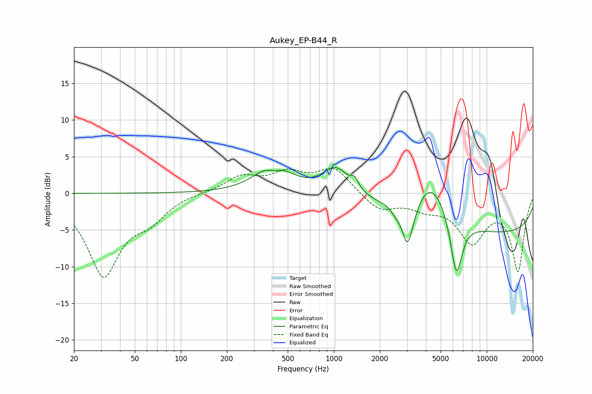

# Aukey_EP-B44_R
See [usage instructions](https://github.com/jaakkopasanen/AutoEq#usage) for more options and info.

### Parametric EQs
Apply preamp of -3.6 dB when using parametric equalizer.

|   # | Type    |   Fc (Hz) |    Q |   Gain (dB) |
|-----|---------|-----------|------|-------------|
|   1 | Peaking |       403 | 1.35 |         4.7 |
|   2 | Peaking |       407 | 2.57 |        -1.7 |
|   3 | Peaking |      1035 | 1.64 |         3.8 |
|   4 | Peaking |      1371 | 5.91 |         1.3 |
|   5 | Peaking |      2517 | 5.49 |        -0.6 |
|   6 | Peaking |      3026 | 3.87 |        -5.7 |
|   7 | Peaking |      3243 | 2.79 |        -1   |
|   8 | Peaking |      4347 | 1.07 |         6.6 |
|   9 | Peaking |      6323 | 3.4  |        -8.6 |
|  10 | Peaking |     10000 | 0.18 |        -5.6 |

### Fixed Band EQs
When using fixed band (also called graphic) equalizer, apply preamp of **-3.5 dB** (if available) and set gains manually with these parameters.

|   # | Type    |   Fc (Hz) |    Q |   Gain (dB) |
|-----|---------|-----------|------|-------------|
|   1 | Peaking |        31 | 1.41 |       -11   |
|   2 | Peaking |        62 | 1.41 |        -2.7 |
|   3 | Peaking |       125 | 1.41 |         0.1 |
|   4 | Peaking |       250 | 1.41 |         2.2 |
|   5 | Peaking |       500 | 1.41 |         2.4 |
|   6 | Peaking |      1000 | 1.41 |         3.3 |
|   7 | Peaking |      2000 | 1.41 |        -2.3 |
|   8 | Peaking |      4000 | 1.41 |        -1.6 |
|   9 | Peaking |      8000 | 1.41 |        -6.2 |
|  10 | Peaking |     16000 | 1.41 |       -10.4 |

### Graphs

