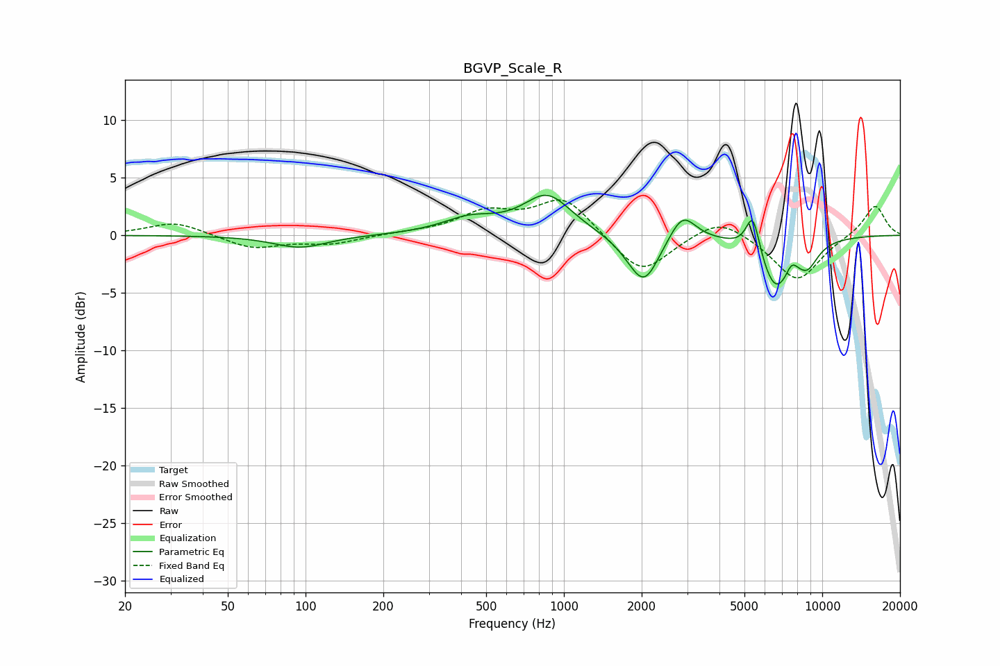

# BGVP_Scale_R
See [usage instructions](https://github.com/jaakkopasanen/AutoEq#usage) for more options and info.

### Parametric EQs
Apply preamp of -3.6 dB when using parametric equalizer.

|   # | Type    |   Fc (Hz) |    Q |   Gain (dB) |
|-----|---------|-----------|------|-------------|
|   1 | Peaking |        95 | 1.37 |        -1.1 |
|   2 | Peaking |       431 | 1.33 |         1.3 |
|   3 | Peaking |       863 | 1.52 |         3.4 |
|   4 | Peaking |      1846 | 1.95 |        -0.7 |
|   5 | Peaking |      2050 | 2.45 |        -3.8 |
|   6 | Peaking |      2878 | 2.83 |         2.4 |
|   7 | Peaking |      5389 | 5.18 |         3.6 |
|   8 | Peaking |      6606 | 2.17 |        -4.6 |
|   9 | Peaking |      7611 | 6    |         1   |
|  10 | Peaking |      8767 | 3.05 |        -1.9 |

### Fixed Band EQs
When using fixed band (also called graphic) equalizer, apply preamp of **-3.2 dB** (if available) and set gains manually with these parameters.

|   # | Type    |   Fc (Hz) |    Q |   Gain (dB) |
|-----|---------|-----------|------|-------------|
|   1 | Peaking |        31 | 1.41 |         1.2 |
|   2 | Peaking |        62 | 1.41 |        -1.2 |
|   3 | Peaking |       125 | 1.41 |        -0.7 |
|   4 | Peaking |       250 | 1.41 |         0.2 |
|   5 | Peaking |       500 | 1.41 |         1.9 |
|   6 | Peaking |      1000 | 1.41 |         3.3 |
|   7 | Peaking |      2000 | 1.41 |        -3.5 |
|   8 | Peaking |      4000 | 1.41 |         1.8 |
|   9 | Peaking |      8000 | 1.41 |        -4   |
|  10 | Peaking |     16000 | 1.41 |         2.7 |

### Graphs

