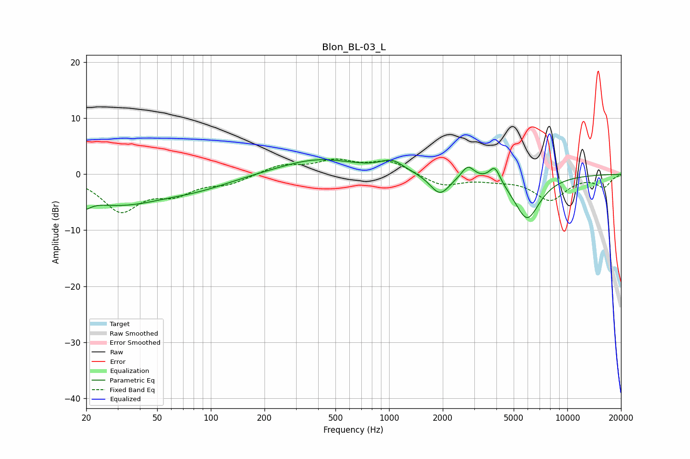

# Blon_BL-03_L
See [usage instructions](https://github.com/jaakkopasanen/AutoEq#usage) for more options and info.

### Parametric EQs
Apply preamp of -2.7 dB when using parametric equalizer.

|   # | Type    |   Fc (Hz) |    Q |   Gain (dB) |
|-----|---------|-----------|------|-------------|
|   1 | Peaking |        20 | 5.32 |        -5.1 |
|   2 | Peaking |        20 | 5.81 |         3.4 |
|   3 | Peaking |        30 | 0.51 |        -5.2 |
|   4 | Peaking |        87 | 0.73 |        -1.5 |
|   5 | Peaking |       400 | 0.65 |         2.8 |
|   6 | Peaking |      1038 | 2.1  |         1.9 |
|   7 | Peaking |      1927 | 2.54 |        -3.7 |
|   8 | Peaking |      2766 | 4.03 |         2.3 |
|   9 | Peaking |      3920 | 4.54 |         2.9 |
|  10 | Peaking |      5943 | 1.86 |        -7.9 |

### Fixed Band EQs
When using fixed band (also called graphic) equalizer, apply preamp of **-2.8 dB** (if available) and set gains manually with these parameters.

|   # | Type    |   Fc (Hz) |    Q |   Gain (dB) |
|-----|---------|-----------|------|-------------|
|   1 | Peaking |        31 | 1.41 |        -6.3 |
|   2 | Peaking |        62 | 1.41 |        -2.9 |
|   3 | Peaking |       125 | 1.41 |        -1.5 |
|   4 | Peaking |       250 | 1.41 |         1.6 |
|   5 | Peaking |       500 | 1.41 |         2.2 |
|   6 | Peaking |      1000 | 1.41 |         2.3 |
|   7 | Peaking |      2000 | 1.41 |        -2.1 |
|   8 | Peaking |      4000 | 1.41 |        -0.7 |
|   9 | Peaking |      8000 | 1.41 |        -4.4 |
|  10 | Peaking |     16000 | 1.41 |        -2.1 |

### Graphs

