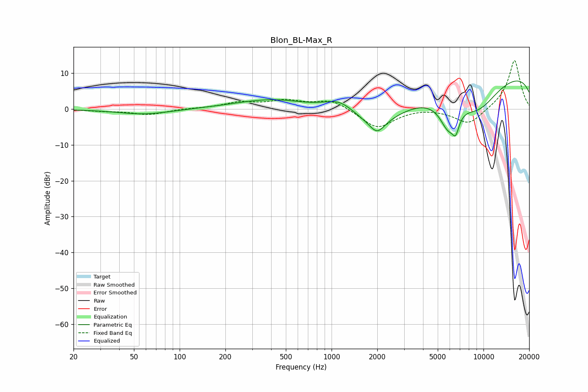

# Blon_BL-Max_R
See [usage instructions](https://github.com/jaakkopasanen/AutoEq#usage) for more options and info.

### Parametric EQs
Apply preamp of -7.9 dB when using parametric equalizer.

|   # | Type    |   Fc (Hz) |    Q |   Gain (dB) |
|-----|---------|-----------|------|-------------|
|   1 | Peaking |        58 | 0.82 |        -1.5 |
|   2 | Peaking |       330 | 4.52 |        -0   |
|   3 | Peaking |       421 | 0.58 |         3   |
|   4 | Peaking |      1138 | 1.29 |         4.3 |
|   5 | Peaking |      1930 | 0.55 |        -9.8 |
|   6 | Peaking |      1995 | 2.87 |        -3.7 |
|   7 | Peaking |      5845 | 2.38 |        -7.7 |
|   8 | Peaking |      6562 | 6    |        -4.4 |
|   9 | Peaking |      9237 | 0.6  |       -14.4 |
|  10 | Peaking |      9623 | 0.19 |        16.4 |

### Fixed Band EQs
When using fixed band (also called graphic) equalizer, apply preamp of **-13.6 dB** (if available) and set gains manually with these parameters.

|   # | Type    |   Fc (Hz) |    Q |   Gain (dB) |
|-----|---------|-----------|------|-------------|
|   1 | Peaking |        31 | 1.41 |        -0.5 |
|   2 | Peaking |        62 | 1.41 |        -1.5 |
|   3 | Peaking |       125 | 1.41 |         0.2 |
|   4 | Peaking |       250 | 1.41 |         1.7 |
|   5 | Peaking |       500 | 1.41 |         2.1 |
|   6 | Peaking |      1000 | 1.41 |         2.6 |
|   7 | Peaking |      2000 | 1.41 |        -5.4 |
|   8 | Peaking |      4000 | 1.41 |         0.4 |
|   9 | Peaking |      8000 | 1.41 |        -4.5 |
|  10 | Peaking |     16000 | 1.41 |        13.9 |

### Graphs

