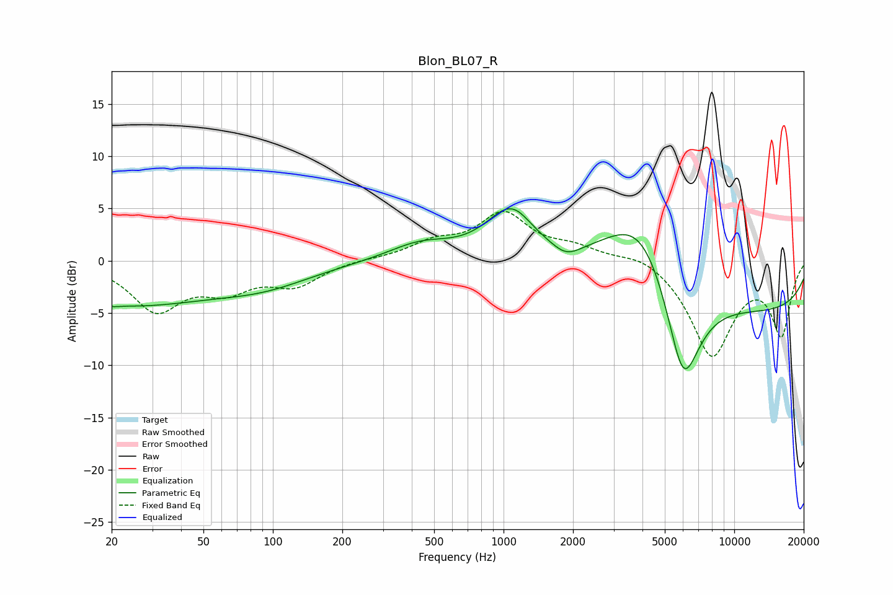

# Blon_BL07_R
See [usage instructions](https://github.com/jaakkopasanen/AutoEq#usage) for more options and info.

### Parametric EQs
Apply preamp of -5.1 dB when using parametric equalizer.

|   # | Type    |   Fc (Hz) |    Q |   Gain (dB) |
|-----|---------|-----------|------|-------------|
|   1 | Peaking |        20 | 5.7  |        -0.2 |
|   2 | Peaking |        22 | 0.36 |        -4.1 |
|   3 | Peaking |        93 | 0.66 |        -1.7 |
|   4 | Peaking |       436 | 1.01 |         1.6 |
|   5 | Peaking |      1064 | 1.33 |         4.7 |
|   6 | Peaking |      1149 | 3.43 |         0.2 |
|   7 | Peaking |      1869 | 2.38 |        -1.1 |
|   8 | Peaking |      3983 | 0.79 |         8.8 |
|   9 | Peaking |      5994 | 1.71 |       -11.2 |
|  10 | Peaking |     10000 | 0.18 |        -5   |

### Fixed Band EQs
When using fixed band (also called graphic) equalizer, apply preamp of **-4.8 dB** (if available) and set gains manually with these parameters.

|   # | Type    |   Fc (Hz) |    Q |   Gain (dB) |
|-----|---------|-----------|------|-------------|
|   1 | Peaking |        31 | 1.41 |        -4.6 |
|   2 | Peaking |        62 | 1.41 |        -2.4 |
|   3 | Peaking |       125 | 1.41 |        -2.2 |
|   4 | Peaking |       250 | 1.41 |         0.1 |
|   5 | Peaking |       500 | 1.41 |         1.5 |
|   6 | Peaking |      1000 | 1.41 |         4.3 |
|   7 | Peaking |      2000 | 1.41 |         1.1 |
|   8 | Peaking |      4000 | 1.41 |         0.9 |
|   9 | Peaking |      8000 | 1.41 |        -9   |
|  10 | Peaking |     16000 | 1.41 |        -6.9 |

### Graphs

