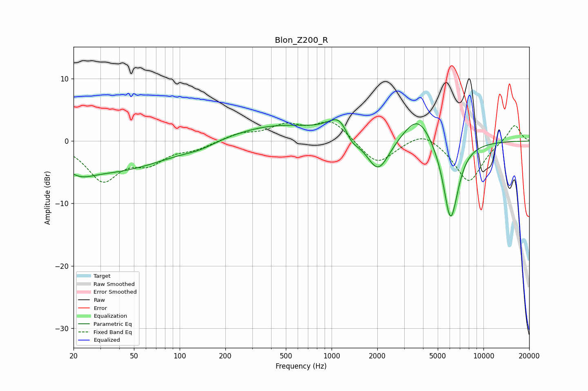

# Blon_Z200_R
See [usage instructions](https://github.com/jaakkopasanen/AutoEq#usage) for more options and info.

### Parametric EQs
Apply preamp of -3.5 dB when using parametric equalizer.

|   # | Type    |   Fc (Hz) |    Q |   Gain (dB) |
|-----|---------|-----------|------|-------------|
|   1 | Peaking |        22 | 1.58 |        -1.7 |
|   2 | Peaking |        36 | 0.38 |        -4.7 |
|   3 | Peaking |       136 | 1.39 |        -0.7 |
|   4 | Peaking |       439 | 0.45 |         2.6 |
|   5 | Peaking |      1141 | 1.91 |         3.6 |
|   6 | Peaking |      1347 | 2.91 |        -2.1 |
|   7 | Peaking |      2023 | 1.87 |        -5.7 |
|   8 | Peaking |      3705 | 1.45 |         4.8 |
|   9 | Peaking |      6035 | 2.73 |       -11.6 |
|  10 | Peaking |      6380 | 3.11 |        -1.9 |

### Fixed Band EQs
When using fixed band (also called graphic) equalizer, apply preamp of **-3.2 dB** (if available) and set gains manually with these parameters.

|   # | Type    |   Fc (Hz) |    Q |   Gain (dB) |
|-----|---------|-----------|------|-------------|
|   1 | Peaking |        31 | 1.41 |        -6   |
|   2 | Peaking |        62 | 1.41 |        -2.9 |
|   3 | Peaking |       125 | 1.41 |        -1.1 |
|   4 | Peaking |       250 | 1.41 |         1.1 |
|   5 | Peaking |       500 | 1.41 |         2.3 |
|   6 | Peaking |      1000 | 1.41 |         3.3 |
|   7 | Peaking |      2000 | 1.41 |        -3.9 |
|   8 | Peaking |      4000 | 1.41 |         1.9 |
|   9 | Peaking |      8000 | 1.41 |        -6.6 |
|  10 | Peaking |     16000 | 1.41 |         2.8 |

### Graphs

