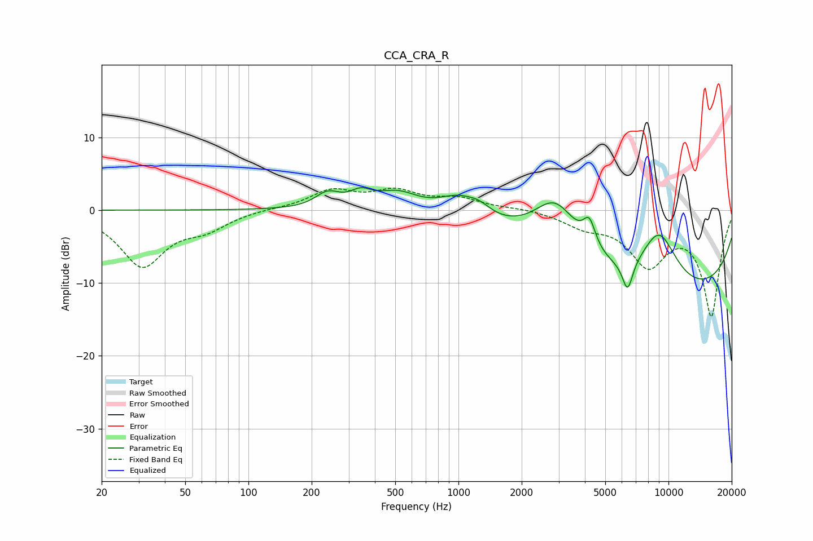

# CCA_CRA_R
See [usage instructions](https://github.com/jaakkopasanen/AutoEq#usage) for more options and info.

### Parametric EQs
Apply preamp of -3.2 dB when using parametric equalizer.

|   # | Type    |   Fc (Hz) |    Q |   Gain (dB) |
|-----|---------|-----------|------|-------------|
|   1 | Peaking |       238 | 2.4  |         2   |
|   2 | Peaking |       343 | 2.74 |         1.7 |
|   3 | Peaking |       513 | 1.44 |         2.4 |
|   4 | Peaking |       996 | 1.52 |         2.5 |
|   5 | Peaking |      1257 | 2.48 |         1.2 |
|   6 | Peaking |      2901 | 1.25 |         7.6 |
|   7 | Peaking |      4201 | 4.72 |         3.6 |
|   8 | Peaking |      6387 | 5.41 |        -4.2 |
|   9 | Peaking |      9011 | 1.37 |         8.1 |
|  10 | Peaking |      9776 | 0.19 |       -12   |

### Fixed Band EQs
When using fixed band (also called graphic) equalizer, apply preamp of **-3.1 dB** (if available) and set gains manually with these parameters.

|   # | Type    |   Fc (Hz) |    Q |   Gain (dB) |
|-----|---------|-----------|------|-------------|
|   1 | Peaking |        31 | 1.41 |        -7.5 |
|   2 | Peaking |        62 | 1.41 |        -2.1 |
|   3 | Peaking |       125 | 1.41 |         0.2 |
|   4 | Peaking |       250 | 1.41 |         2.6 |
|   5 | Peaking |       500 | 1.41 |         2.3 |
|   6 | Peaking |      1000 | 1.41 |         1.4 |
|   7 | Peaking |      2000 | 1.41 |         0.3 |
|   8 | Peaking |      4000 | 1.41 |        -1.8 |
|   9 | Peaking |      8000 | 1.41 |        -6.9 |
|  10 | Peaking |     16000 | 1.41 |       -14.3 |

### Graphs

