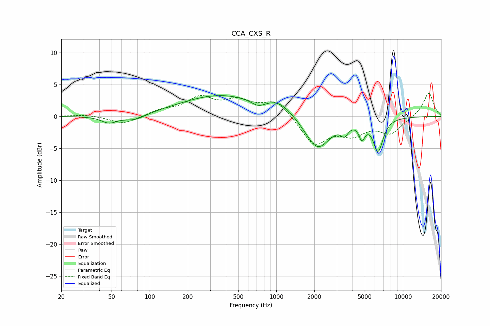

# CCA_CXS_R
See [usage instructions](https://github.com/jaakkopasanen/AutoEq#usage) for more options and info.

### Parametric EQs
Apply preamp of -3.3 dB when using parametric equalizer.

|   # | Type    |   Fc (Hz) |    Q |   Gain (dB) |
|-----|---------|-----------|------|-------------|
|   1 | Peaking |        48 | 2.32 |        -1.1 |
|   2 | Peaking |        77 | 1.67 |        -0.9 |
|   3 | Peaking |       363 | 0.44 |         3.3 |
|   4 | Peaking |       721 | 2.61 |        -0.9 |
|   5 | Peaking |      1056 | 1.37 |         1.7 |
|   6 | Peaking |      2113 | 1.42 |        -5.3 |
|   7 | Peaking |      3455 | 4.85 |        -1.5 |
|   8 | Peaking |      4748 | 5.92 |        -2.4 |
|   9 | Peaking |      6394 | 3.84 |        -6.1 |
|  10 | Peaking |      6466 | 5.99 |         1.1 |

### Fixed Band EQs
When using fixed band (also called graphic) equalizer, apply preamp of **-3.7 dB** (if available) and set gains manually with these parameters.

|   # | Type    |   Fc (Hz) |    Q |   Gain (dB) |
|-----|---------|-----------|------|-------------|
|   1 | Peaking |        31 | 1.41 |         0.3 |
|   2 | Peaking |        62 | 1.41 |        -1.3 |
|   3 | Peaking |       125 | 1.41 |         0.9 |
|   4 | Peaking |       250 | 1.41 |         2.7 |
|   5 | Peaking |       500 | 1.41 |         2.1 |
|   6 | Peaking |      1000 | 1.41 |         2.5 |
|   7 | Peaking |      2000 | 1.41 |        -4.4 |
|   8 | Peaking |      4000 | 1.41 |        -2.4 |
|   9 | Peaking |      8000 | 1.41 |        -2.5 |
|  10 | Peaking |     16000 | 1.41 |         3.8 |

### Graphs

