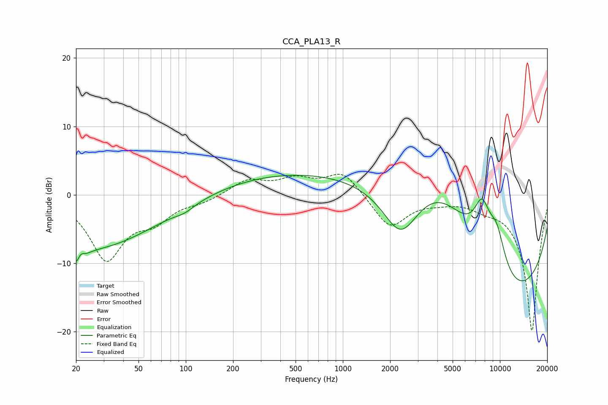

# CCA_PLA13_R
See [usage instructions](https://github.com/jaakkopasanen/AutoEq#usage) for more options and info.

### Parametric EQs
Apply preamp of -3.0 dB when using parametric equalizer.

|   # | Type    |   Fc (Hz) |    Q |   Gain (dB) |
|-----|---------|-----------|------|-------------|
|   1 | Peaking |        21 | 3.82 |        -4.8 |
|   2 | Peaking |        21 | 5.68 |         2.9 |
|   3 | Peaking |        27 | 0.36 |        -7.6 |
|   4 | Peaking |        98 | 2.4  |        -0.7 |
|   5 | Peaking |       853 | 0.18 |         3.7 |
|   6 | Peaking |      2337 | 1.19 |        -7.9 |
|   7 | Peaking |      4183 | 0.5  |        10.6 |
|   8 | Peaking |      7688 | 2.46 |         6.5 |
|   9 | Peaking |      9530 | 2.17 |         5.8 |
|  10 | Peaking |     10000 | 0.24 |       -17.3 |

### Fixed Band EQs
When using fixed band (also called graphic) equalizer, apply preamp of **-3.1 dB** (if available) and set gains manually with these parameters.

|   # | Type    |   Fc (Hz) |    Q |   Gain (dB) |
|-----|---------|-----------|------|-------------|
|   1 | Peaking |        31 | 1.41 |        -9.2 |
|   2 | Peaking |        62 | 1.41 |        -3   |
|   3 | Peaking |       125 | 1.41 |        -0.8 |
|   4 | Peaking |       250 | 1.41 |         2.1 |
|   5 | Peaking |       500 | 1.41 |         2   |
|   6 | Peaking |      1000 | 1.41 |         3.4 |
|   7 | Peaking |      2000 | 1.41 |        -4.9 |
|   8 | Peaking |      4000 | 1.41 |        -0.6 |
|   9 | Peaking |      8000 | 1.41 |        -1.1 |
|  10 | Peaking |     16000 | 1.41 |       -20   |

### Graphs

