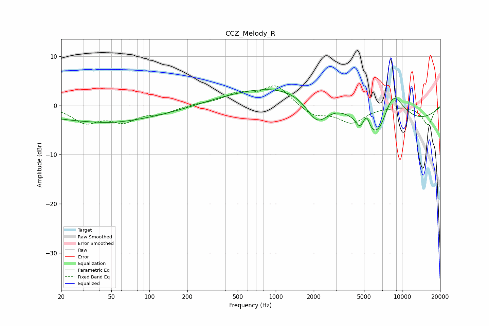

# CCZ_Melody_R
See [usage instructions](https://github.com/jaakkopasanen/AutoEq#usage) for more options and info.

### Parametric EQs
Apply preamp of -3.3 dB when using parametric equalizer.

|   # | Type    |   Fc (Hz) |    Q |   Gain (dB) |
|-----|---------|-----------|------|-------------|
|   1 | Peaking |        36 | 0.31 |        -3   |
|   2 | Peaking |        52 | 1.09 |        -0.3 |
|   3 | Peaking |       249 | 0.34 |        -1.8 |
|   4 | Peaking |       689 | 0.3  |         4   |
|   5 | Peaking |      2130 | 1.54 |        -5.7 |
|   6 | Peaking |      4081 | 0.37 |         8.3 |
|   7 | Peaking |      4589 | 6    |        -1.2 |
|   8 | Peaking |      5248 | 5.82 |         2.6 |
|   9 | Peaking |      6474 | 0.57 |       -20   |
|  10 | Peaking |      8284 | 1.13 |        11.9 |

### Fixed Band EQs
When using fixed band (also called graphic) equalizer, apply preamp of **-4.1 dB** (if available) and set gains manually with these parameters.

|   # | Type    |   Fc (Hz) |    Q |   Gain (dB) |
|-----|---------|-----------|------|-------------|
|   1 | Peaking |        31 | 1.41 |        -3.2 |
|   2 | Peaking |        62 | 1.41 |        -2.9 |
|   3 | Peaking |       125 | 1.41 |        -1.3 |
|   4 | Peaking |       250 | 1.41 |         0.3 |
|   5 | Peaking |       500 | 1.41 |         2.1 |
|   6 | Peaking |      1000 | 1.41 |         4.1 |
|   7 | Peaking |      2000 | 1.41 |        -2.1 |
|   8 | Peaking |      4000 | 1.41 |        -3.4 |
|   9 | Peaking |      8000 | 1.41 |        -0.1 |
|  10 | Peaking |     16000 | 1.41 |        -3.9 |

### Graphs

