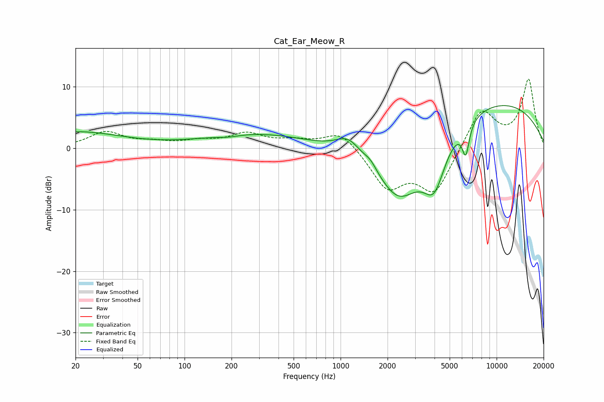

# Cat_Ear_Meow_R
See [usage instructions](https://github.com/jaakkopasanen/AutoEq#usage) for more options and info.

### Parametric EQs
Apply preamp of -7.0 dB when using parametric equalizer.

|   # | Type    |   Fc (Hz) |    Q |   Gain (dB) |
|-----|---------|-----------|------|-------------|
|   1 | Peaking |        20 | 0.48 |         2.6 |
|   2 | Peaking |        51 | 5.75 |        -0   |
|   3 | Peaking |       191 | 2.02 |        -0.3 |
|   4 | Peaking |       296 | 0.41 |         2.3 |
|   5 | Peaking |      1127 | 1.74 |         2.9 |
|   6 | Peaking |      1556 | 3.45 |         1.1 |
|   7 | Peaking |      2372 | 0.88 |       -10.5 |
|   8 | Peaking |      3980 | 1.88 |        -7.9 |
|   9 | Peaking |      6342 | 6    |        -5   |
|  10 | Peaking |      8903 | 0.27 |         7.9 |

### Fixed Band EQs
When using fixed band (also called graphic) equalizer, apply preamp of **-11.3 dB** (if available) and set gains manually with these parameters.

|   # | Type    |   Fc (Hz) |    Q |   Gain (dB) |
|-----|---------|-----------|------|-------------|
|   1 | Peaking |        31 | 1.41 |         2.5 |
|   2 | Peaking |        62 | 1.41 |         0.8 |
|   3 | Peaking |       125 | 1.41 |         0.9 |
|   4 | Peaking |       250 | 1.41 |         2.2 |
|   5 | Peaking |       500 | 1.41 |         1   |
|   6 | Peaking |      1000 | 1.41 |         3   |
|   7 | Peaking |      2000 | 1.41 |        -6.2 |
|   8 | Peaking |      4000 | 1.41 |        -7.1 |
|   9 | Peaking |      8000 | 1.41 |         6.5 |
|  10 | Peaking |     16000 | 1.41 |        11   |

### Graphs

