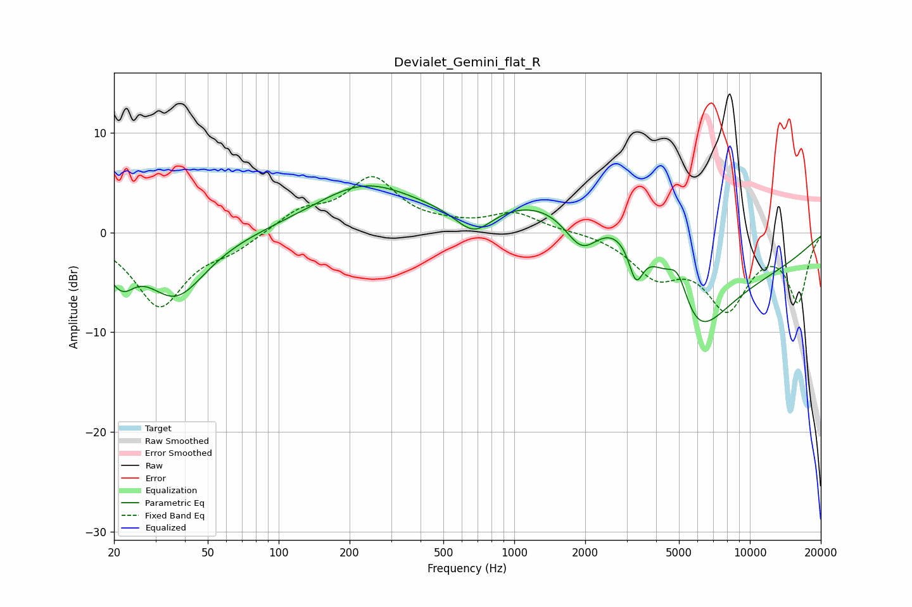

# Devialet_Gemini_flat_R
See [usage instructions](https://github.com/jaakkopasanen/AutoEq#usage) for more options and info.

### Parametric EQs
Apply preamp of -4.8 dB when using parametric equalizer.

|   # | Type    |   Fc (Hz) |    Q |   Gain (dB) |
|-----|---------|-----------|------|-------------|
|   1 | Peaking |        20 | 2.9  |        -1.7 |
|   2 | Peaking |        22 | 2.96 |        -2   |
|   3 | Peaking |        37 | 1.09 |        -6.3 |
|   4 | Peaking |       230 | 0.66 |         4.5 |
|   5 | Peaking |       674 | 1.77 |        -2.9 |
|   6 | Peaking |      1937 | 1.82 |        -4.4 |
|   7 | Peaking |      3284 | 4.59 |        -3.9 |
|   8 | Peaking |      3382 | 0.32 |        12.4 |
|   9 | Peaking |      4957 | 3.03 |         3.8 |
|  10 | Peaking |      5753 | 0.53 |       -20   |

### Fixed Band EQs
When using fixed band (also called graphic) equalizer, apply preamp of **-5.7 dB** (if available) and set gains manually with these parameters.

|   # | Type    |   Fc (Hz) |    Q |   Gain (dB) |
|-----|---------|-----------|------|-------------|
|   1 | Peaking |        31 | 1.41 |        -7.3 |
|   2 | Peaking |        62 | 1.41 |        -1.4 |
|   3 | Peaking |       125 | 1.41 |         2   |
|   4 | Peaking |       250 | 1.41 |         5.2 |
|   5 | Peaking |       500 | 1.41 |         0.4 |
|   6 | Peaking |      1000 | 1.41 |         1.9 |
|   7 | Peaking |      2000 | 1.41 |         0.1 |
|   8 | Peaking |      4000 | 1.41 |        -3.8 |
|   9 | Peaking |      8000 | 1.41 |        -7.1 |
|  10 | Peaking |     16000 | 1.41 |        -6.7 |

### Graphs

