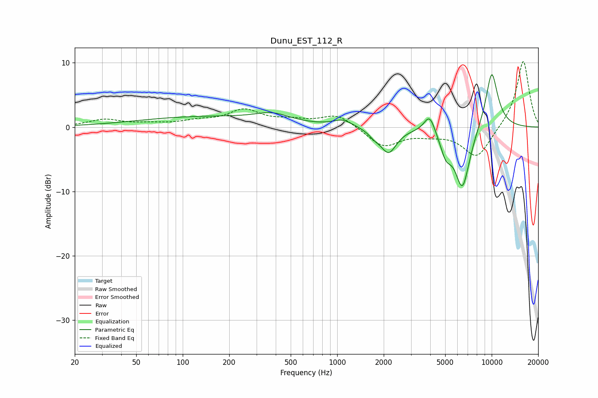

# Dunu_EST_112_R
See [usage instructions](https://github.com/jaakkopasanen/AutoEq#usage) for more options and info.

### Parametric EQs
Apply preamp of -8.3 dB when using parametric equalizer.

|   # | Type    |   Fc (Hz) |    Q |   Gain (dB) |
|-----|---------|-----------|------|-------------|
|   1 | Peaking |       133 | 0.33 |         1.6 |
|   2 | Peaking |       382 | 1.26 |         1.3 |
|   3 | Peaking |      1086 | 2.31 |         1.1 |
|   4 | Peaking |      1740 | 3.83 |        -0.8 |
|   5 | Peaking |      2152 | 2.75 |        -3.8 |
|   6 | Peaking |      3966 | 3.84 |         3   |
|   7 | Peaking |      5044 | 3.78 |        -3   |
|   8 | Peaking |      6466 | 2.67 |        -9.6 |
|   9 | Peaking |      9999 | 3.97 |         4.6 |
|  10 | Peaking |     10000 | 2.05 |         4.7 |

### Fixed Band EQs
When using fixed band (also called graphic) equalizer, apply preamp of **-10.3 dB** (if available) and set gains manually with these parameters.

|   # | Type    |   Fc (Hz) |    Q |   Gain (dB) |
|-----|---------|-----------|------|-------------|
|   1 | Peaking |        31 | 1.41 |         1.1 |
|   2 | Peaking |        62 | 1.41 |         0.4 |
|   3 | Peaking |       125 | 1.41 |         0.8 |
|   4 | Peaking |       250 | 1.41 |         2.5 |
|   5 | Peaking |       500 | 1.41 |         0.8 |
|   6 | Peaking |      1000 | 1.41 |         2   |
|   7 | Peaking |      2000 | 1.41 |        -3   |
|   8 | Peaking |      4000 | 1.41 |        -0.8 |
|   9 | Peaking |      8000 | 1.41 |        -4.8 |
|  10 | Peaking |     16000 | 1.41 |        10.5 |

### Graphs

