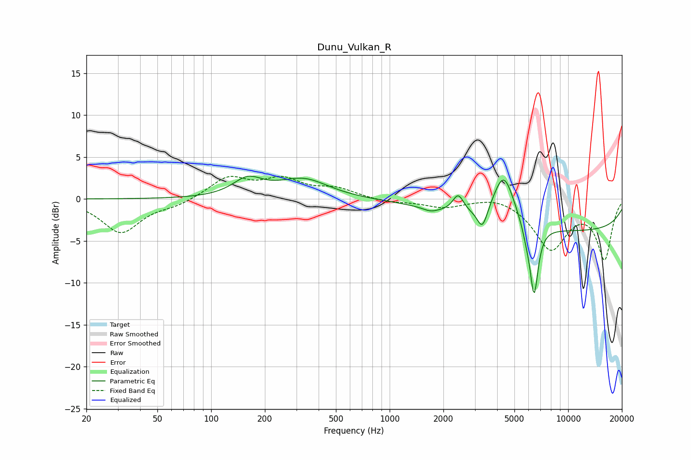

# Dunu_Vulkan_R
See [usage instructions](https://github.com/jaakkopasanen/AutoEq#usage) for more options and info.

### Parametric EQs
Apply preamp of -2.8 dB when using parametric equalizer.

|   # | Type    |   Fc (Hz) |    Q |   Gain (dB) |
|-----|---------|-----------|------|-------------|
|   1 | Peaking |       160 | 1.73 |         2.1 |
|   2 | Peaking |       329 | 1.01 |         2.3 |
|   3 | Peaking |      1695 | 3.34 |        -0.4 |
|   4 | Peaking |      2421 | 4.62 |         2.1 |
|   5 | Peaking |      3309 | 5.05 |        -2.5 |
|   6 | Peaking |      4357 | 2.32 |         6   |
|   7 | Peaking |      5390 | 3.91 |        -0.1 |
|   8 | Peaking |      5815 | 6    |        -1   |
|   9 | Peaking |      6439 | 5.83 |        -8.5 |
|  10 | Peaking |     10000 | 0.19 |        -3.8 |

### Fixed Band EQs
When using fixed band (also called graphic) equalizer, apply preamp of **-2.8 dB** (if available) and set gains manually with these parameters.

|   # | Type    |   Fc (Hz) |    Q |   Gain (dB) |
|-----|---------|-----------|------|-------------|
|   1 | Peaking |        31 | 1.41 |        -4   |
|   2 | Peaking |        62 | 1.41 |        -0.7 |
|   3 | Peaking |       125 | 1.41 |         2.5 |
|   4 | Peaking |       250 | 1.41 |         2.1 |
|   5 | Peaking |       500 | 1.41 |         1.1 |
|   6 | Peaking |      1000 | 1.41 |        -0.4 |
|   7 | Peaking |      2000 | 1.41 |        -0.9 |
|   8 | Peaking |      4000 | 1.41 |         0.6 |
|   9 | Peaking |      8000 | 1.41 |        -5.8 |
|  10 | Peaking |     16000 | 1.41 |        -7   |

### Graphs

