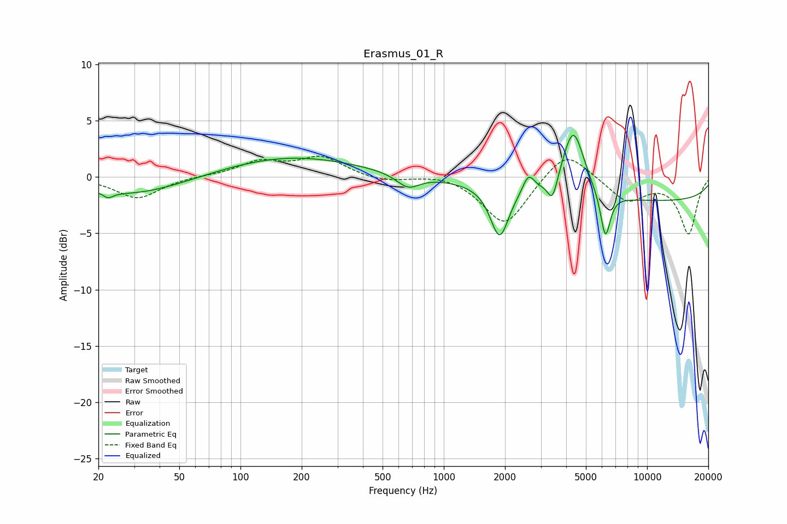

# Erasmus_01_R
See [usage instructions](https://github.com/jaakkopasanen/AutoEq#usage) for more options and info.

### Parametric EQs
Apply preamp of -3.8 dB when using parametric equalizer.

|   # | Type    |   Fc (Hz) |    Q |   Gain (dB) |
|-----|---------|-----------|------|-------------|
|   1 | Peaking |        22 | 5.68 |        -0.5 |
|   2 | Peaking |        30 | 0.55 |        -1.6 |
|   3 | Peaking |       175 | 0.42 |         1.8 |
|   4 | Peaking |       667 | 2.49 |        -1.2 |
|   5 | Peaking |      1881 | 3.16 |        -4.6 |
|   6 | Peaking |      2609 | 5.03 |         1.6 |
|   7 | Peaking |      3427 | 5.88 |        -2.1 |
|   8 | Peaking |      4335 | 2.62 |         6   |
|   9 | Peaking |      6235 | 5.75 |        -4.1 |
|  10 | Peaking |     10000 | 0.18 |        -2.1 |

### Fixed Band EQs
When using fixed band (also called graphic) equalizer, apply preamp of **-1.9 dB** (if available) and set gains manually with these parameters.

|   # | Type    |   Fc (Hz) |    Q |   Gain (dB) |
|-----|---------|-----------|------|-------------|
|   1 | Peaking |        31 | 1.41 |        -1.9 |
|   2 | Peaking |        62 | 1.41 |         0.1 |
|   3 | Peaking |       125 | 1.41 |         1.3 |
|   4 | Peaking |       250 | 1.41 |         1.7 |
|   5 | Peaking |       500 | 1.41 |        -0.4 |
|   6 | Peaking |      1000 | 1.41 |         0.4 |
|   7 | Peaking |      2000 | 1.41 |        -4.4 |
|   8 | Peaking |      4000 | 1.41 |         2.6 |
|   9 | Peaking |      8000 | 1.41 |        -2.1 |
|  10 | Peaking |     16000 | 1.41 |        -5   |

### Graphs

