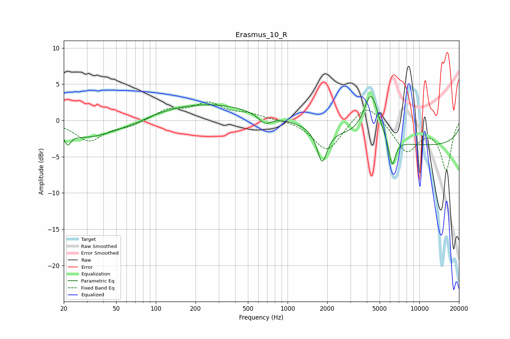

# Erasmus_10_R
See [usage instructions](https://github.com/jaakkopasanen/AutoEq#usage) for more options and info.

### Parametric EQs
Apply preamp of -3.4 dB when using parametric equalizer.

|   # | Type    |   Fc (Hz) |    Q |   Gain (dB) |
|-----|---------|-----------|------|-------------|
|   1 | Peaking |        21 | 5.9  |        -1.6 |
|   2 | Peaking |        31 | 0.67 |        -2.4 |
|   3 | Peaking |        57 | 1.46 |        -0.2 |
|   4 | Peaking |        73 | 1.63 |        -0.3 |
|   5 | Peaking |       242 | 0.37 |         2.3 |
|   6 | Peaking |       674 | 2.81 |        -1.3 |
|   7 | Peaking |      1829 | 3.78 |        -4.7 |
|   8 | Peaking |      4305 | 2.54 |         6.4 |
|   9 | Peaking |      6216 | 5.43 |        -4   |
|  10 | Peaking |     10000 | 0.18 |        -3.4 |

### Fixed Band EQs
When using fixed band (also called graphic) equalizer, apply preamp of **-2.6 dB** (if available) and set gains manually with these parameters.

|   # | Type    |   Fc (Hz) |    Q |   Gain (dB) |
|-----|---------|-----------|------|-------------|
|   1 | Peaking |        31 | 1.41 |        -2.8 |
|   2 | Peaking |        62 | 1.41 |        -0.7 |
|   3 | Peaking |       125 | 1.41 |         1.4 |
|   4 | Peaking |       250 | 1.41 |         2.2 |
|   5 | Peaking |       500 | 1.41 |         0.8 |
|   6 | Peaking |      1000 | 1.41 |         0.2 |
|   7 | Peaking |      2000 | 1.41 |        -4.3 |
|   8 | Peaking |      4000 | 1.41 |         2.8 |
|   9 | Peaking |      8000 | 1.41 |        -4.2 |
|  10 | Peaking |     16000 | 1.41 |        -6.7 |

### Graphs

