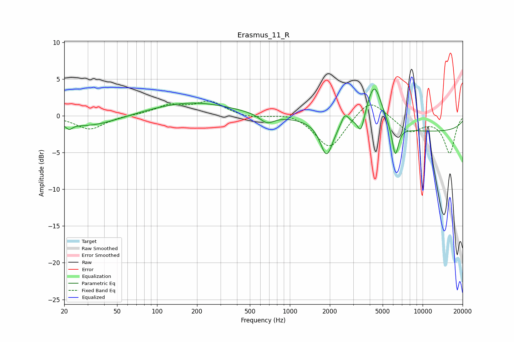

# Erasmus_11_R
See [usage instructions](https://github.com/jaakkopasanen/AutoEq#usage) for more options and info.

### Parametric EQs
Apply preamp of -3.7 dB when using parametric equalizer.

|   # | Type    |   Fc (Hz) |    Q |   Gain (dB) |
|-----|---------|-----------|------|-------------|
|   1 | Peaking |        22 | 5.98 |        -0.7 |
|   2 | Peaking |        30 | 0.65 |        -1.5 |
|   3 | Peaking |       181 | 0.46 |         1.9 |
|   4 | Peaking |       673 | 2.57 |        -1.2 |
|   5 | Peaking |      1891 | 3.03 |        -4.6 |
|   6 | Peaking |      2598 | 4.99 |         1.7 |
|   7 | Peaking |      3430 | 5.76 |        -2.4 |
|   8 | Peaking |      4324 | 2.44 |         6   |
|   9 | Peaking |      6225 | 5.74 |        -4.3 |
|  10 | Peaking |     10000 | 0.18 |        -2.2 |

### Fixed Band EQs
When using fixed band (also called graphic) equalizer, apply preamp of **-2.1 dB** (if available) and set gains manually with these parameters.

|   # | Type    |   Fc (Hz) |    Q |   Gain (dB) |
|-----|---------|-----------|------|-------------|
|   1 | Peaking |        31 | 1.41 |        -1.9 |
|   2 | Peaking |        62 | 1.41 |         0.1 |
|   3 | Peaking |       125 | 1.41 |         1.3 |
|   4 | Peaking |       250 | 1.41 |         1.8 |
|   5 | Peaking |       500 | 1.41 |        -0.4 |
|   6 | Peaking |      1000 | 1.41 |         0.5 |
|   7 | Peaking |      2000 | 1.41 |        -4.5 |
|   8 | Peaking |      4000 | 1.41 |         2.6 |
|   9 | Peaking |      8000 | 1.41 |        -2.1 |
|  10 | Peaking |     16000 | 1.41 |        -5   |

### Graphs

