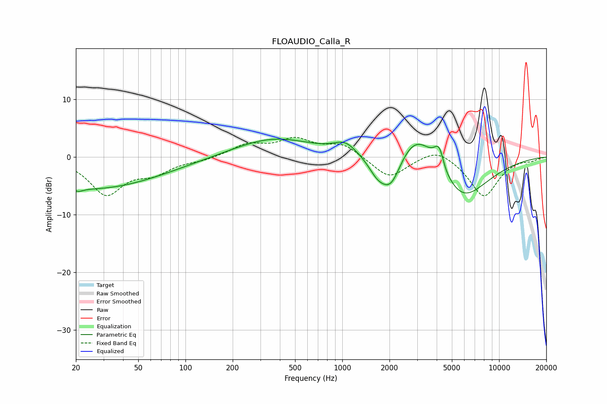

# FLOAUDIO_Calla_R
See [usage instructions](https://github.com/jaakkopasanen/AutoEq#usage) for more options and info.

### Parametric EQs
Apply preamp of -3.2 dB when using parametric equalizer.

|   # | Type    |   Fc (Hz) |    Q |   Gain (dB) |
|-----|---------|-----------|------|-------------|
|   1 | Peaking |        21 | 4.73 |        -0.6 |
|   2 | Peaking |        25 | 0.31 |        -5.5 |
|   3 | Peaking |       365 | 0.56 |         3.3 |
|   4 | Peaking |      1044 | 1.96 |         2   |
|   5 | Peaking |      1677 | 2.31 |        -2.8 |
|   6 | Peaking |      2047 | 2.05 |        -6   |
|   7 | Peaking |      2973 | 1.07 |         6.7 |
|   8 | Peaking |      4155 | 4.23 |         4   |
|   9 | Peaking |      4548 | 6    |        -0.5 |
|  10 | Peaking |      5727 | 0.83 |        -8.1 |

### Fixed Band EQs
When using fixed band (also called graphic) equalizer, apply preamp of **-3.5 dB** (if available) and set gains manually with these parameters.

|   # | Type    |   Fc (Hz) |    Q |   Gain (dB) |
|-----|---------|-----------|------|-------------|
|   1 | Peaking |        31 | 1.41 |        -6.3 |
|   2 | Peaking |        62 | 1.41 |        -2.4 |
|   3 | Peaking |       125 | 1.41 |        -0.5 |
|   4 | Peaking |       250 | 1.41 |         2.1 |
|   5 | Peaking |       500 | 1.41 |         2.8 |
|   6 | Peaking |      1000 | 1.41 |         2.2 |
|   7 | Peaking |      2000 | 1.41 |        -3.7 |
|   8 | Peaking |      4000 | 1.41 |         1.9 |
|   9 | Peaking |      8000 | 1.41 |        -6.9 |
|  10 | Peaking |     16000 | 1.41 |        -0.5 |

### Graphs

