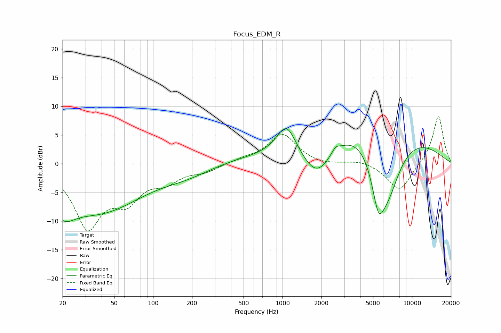

# Focus_EDM_R
See [usage instructions](https://github.com/jaakkopasanen/AutoEq#usage) for more options and info.

### Parametric EQs
Apply preamp of -6.2 dB when using parametric equalizer.

|   # | Type    |   Fc (Hz) |    Q |   Gain (dB) |
|-----|---------|-----------|------|-------------|
|   1 | Peaking |        20 | 1.73 |        -3.4 |
|   2 | Peaking |        39 | 0.37 |        -8.6 |
|   3 | Peaking |       179 | 0.41 |         3.2 |
|   4 | Peaking |       186 | 0.59 |        -3.8 |
|   5 | Peaking |      1074 | 1.91 |         5.3 |
|   6 | Peaking |      1848 | 1.07 |        -7.8 |
|   7 | Peaking |      2567 | 4.83 |         1   |
|   8 | Peaking |      4468 | 0.28 |         9.5 |
|   9 | Peaking |      5511 | 2.57 |        -8.6 |
|  10 | Peaking |      6571 | 1.21 |       -10.6 |

### Fixed Band EQs
When using fixed band (also called graphic) equalizer, apply preamp of **-8.3 dB** (if available) and set gains manually with these parameters.

|   # | Type    |   Fc (Hz) |    Q |   Gain (dB) |
|-----|---------|-----------|------|-------------|
|   1 | Peaking |        31 | 1.41 |       -10.6 |
|   2 | Peaking |        62 | 1.41 |        -5.2 |
|   3 | Peaking |       125 | 1.41 |        -2.5 |
|   4 | Peaking |       250 | 1.41 |        -1.2 |
|   5 | Peaking |       500 | 1.41 |         0.7 |
|   6 | Peaking |      1000 | 1.41 |         5.1 |
|   7 | Peaking |      2000 | 1.41 |        -0.4 |
|   8 | Peaking |      4000 | 1.41 |         0.7 |
|   9 | Peaking |      8000 | 1.41 |        -4.9 |
|  10 | Peaking |     16000 | 1.41 |         8.5 |

### Graphs

