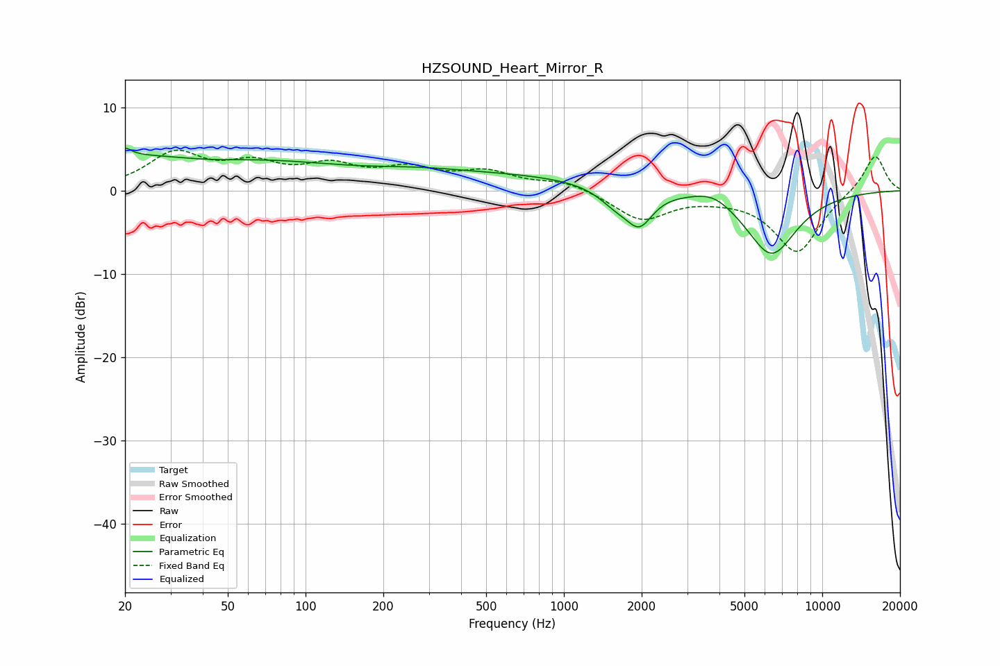

# HZSOUND_Heart_Mirror_R
See [usage instructions](https://github.com/jaakkopasanen/AutoEq#usage) for more options and info.

### Parametric EQs
Apply preamp of -5.2 dB when using parametric equalizer.

|   # | Type    |   Fc (Hz) |    Q |   Gain (dB) |
|-----|---------|-----------|------|-------------|
|   1 | Peaking |        20 | 5.93 |         3   |
|   2 | Peaking |        20 | 5.93 |        -2.2 |
|   3 | Peaking |        28 | 0.2  |         4.5 |
|   4 | Peaking |        42 | 0.87 |        -0.8 |
|   5 | Peaking |       265 | 0.77 |         0.7 |
|   6 | Peaking |       604 | 0.36 |         1.7 |
|   7 | Peaking |      1594 | 2.06 |        -1.9 |
|   8 | Peaking |      1963 | 2.76 |        -3.8 |
|   9 | Peaking |      3798 | 1.85 |         1.3 |
|  10 | Peaking |      6347 | 1.37 |        -7.7 |

### Fixed Band EQs
When using fixed band (also called graphic) equalizer, apply preamp of **-5.0 dB** (if available) and set gains manually with these parameters.

|   # | Type    |   Fc (Hz) |    Q |   Gain (dB) |
|-----|---------|-----------|------|-------------|
|   1 | Peaking |        31 | 1.41 |         4.2 |
|   2 | Peaking |        62 | 1.41 |         2.7 |
|   3 | Peaking |       125 | 1.41 |         2.5 |
|   4 | Peaking |       250 | 1.41 |         2.2 |
|   5 | Peaking |       500 | 1.41 |         2   |
|   6 | Peaking |      1000 | 1.41 |         1.1 |
|   7 | Peaking |      2000 | 1.41 |        -3.4 |
|   8 | Peaking |      4000 | 1.41 |        -0.4 |
|   9 | Peaking |      8000 | 1.41 |        -7.4 |
|  10 | Peaking |     16000 | 1.41 |         4.5 |

### Graphs

