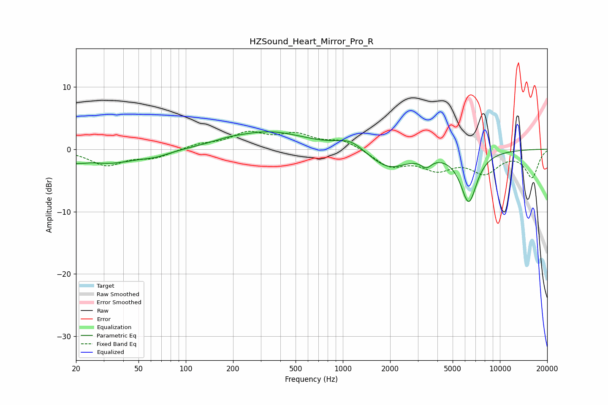

# HZSound_Heart_Mirror_Pro_R
See [usage instructions](https://github.com/jaakkopasanen/AutoEq#usage) for more options and info.

### Parametric EQs
Apply preamp of -2.9 dB when using parametric equalizer.

|   # | Type    |   Fc (Hz) |    Q |   Gain (dB) |
|-----|---------|-----------|------|-------------|
|   1 | Peaking |        20 | 3.53 |        -2.4 |
|   2 | Peaking |        20 | 4.76 |         1.4 |
|   3 | Peaking |        33 | 0.79 |        -2.1 |
|   4 | Peaking |        64 | 1.52 |        -0.7 |
|   5 | Peaking |       182 | 1.52 |         0.4 |
|   6 | Peaking |       339 | 0.61 |         2.8 |
|   7 | Peaking |      1120 | 1.59 |         1.7 |
|   8 | Peaking |      1950 | 1.13 |        -3.1 |
|   9 | Peaking |      3400 | 4.1  |        -1.4 |
|  10 | Peaking |      6334 | 2.58 |        -8.2 |

### Fixed Band EQs
When using fixed band (also called graphic) equalizer, apply preamp of **-3.0 dB** (if available) and set gains manually with these parameters.

|   # | Type    |   Fc (Hz) |    Q |   Gain (dB) |
|-----|---------|-----------|------|-------------|
|   1 | Peaking |        31 | 1.41 |        -2.5 |
|   2 | Peaking |        62 | 1.41 |        -1.3 |
|   3 | Peaking |       125 | 1.41 |         0.7 |
|   4 | Peaking |       250 | 1.41 |         2.4 |
|   5 | Peaking |       500 | 1.41 |         2.1 |
|   6 | Peaking |      1000 | 1.41 |         1.4 |
|   7 | Peaking |      2000 | 1.41 |        -2.6 |
|   8 | Peaking |      4000 | 1.41 |        -2.8 |
|   9 | Peaking |      8000 | 1.41 |        -3.4 |
|  10 | Peaking |     16000 | 1.41 |        -4.4 |

### Graphs

