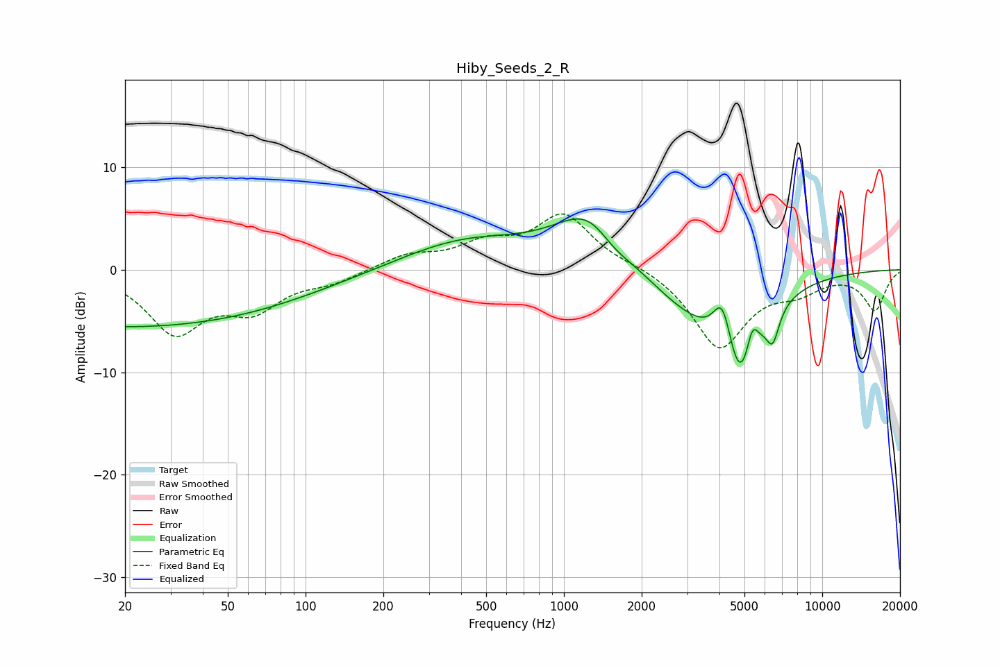

# Hiby_Seeds_2_R
See [usage instructions](https://github.com/jaakkopasanen/AutoEq#usage) for more options and info.

### Parametric EQs
Apply preamp of -5.0 dB when using parametric equalizer.

|   # | Type    |   Fc (Hz) |    Q |   Gain (dB) |
|-----|---------|-----------|------|-------------|
|   1 | Peaking |        20 | 0.19 |        -5.6 |
|   2 | Peaking |        21 | 5.36 |         0   |
|   3 | Peaking |       414 | 0.56 |         2.8 |
|   4 | Peaking |      1296 | 1.01 |         6.3 |
|   5 | Peaking |      1539 | 1.86 |        -1.8 |
|   6 | Peaking |      3256 | 0.73 |        -4.4 |
|   7 | Peaking |      4116 | 3.88 |         5   |
|   8 | Peaking |      4842 | 2.06 |        -9.2 |
|   9 | Peaking |      5354 | 5.83 |         3.3 |
|  10 | Peaking |      6435 | 5.57 |        -3   |

### Fixed Band EQs
When using fixed band (also called graphic) equalizer, apply preamp of **-5.5 dB** (if available) and set gains manually with these parameters.

|   # | Type    |   Fc (Hz) |    Q |   Gain (dB) |
|-----|---------|-----------|------|-------------|
|   1 | Peaking |        31 | 1.41 |        -5.9 |
|   2 | Peaking |        62 | 1.41 |        -3.4 |
|   3 | Peaking |       125 | 1.41 |        -1   |
|   4 | Peaking |       250 | 1.41 |         1.3 |
|   5 | Peaking |       500 | 1.41 |         2.2 |
|   6 | Peaking |      1000 | 1.41 |         5.2 |
|   7 | Peaking |      2000 | 1.41 |         0.4 |
|   8 | Peaking |      4000 | 1.41 |        -7.6 |
|   9 | Peaking |      8000 | 1.41 |        -1.6 |
|  10 | Peaking |     16000 | 1.41 |        -3.9 |

### Graphs

