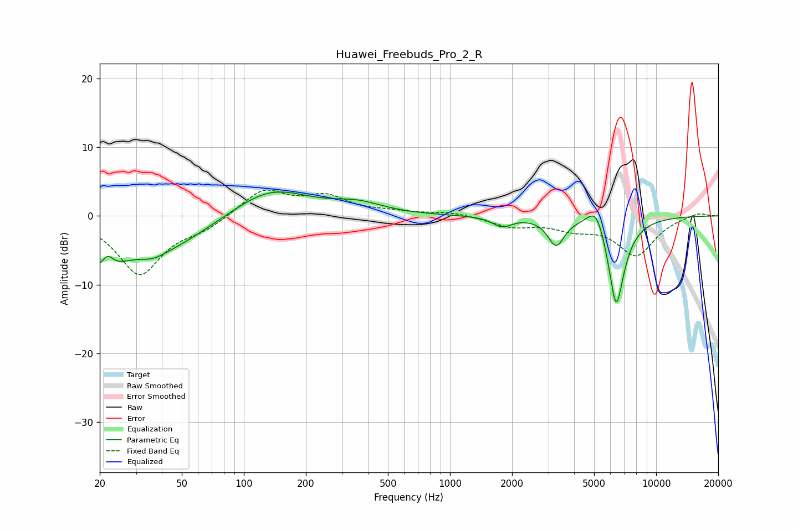

# Huawei_Freebuds_Pro_2_R
See [usage instructions](https://github.com/jaakkopasanen/AutoEq#usage) for more options and info.

### Parametric EQs
Apply preamp of -3.6 dB when using parametric equalizer.

|   # | Type    |   Fc (Hz) |    Q |   Gain (dB) |
|-----|---------|-----------|------|-------------|
|   1 | Peaking |        20 | 1.3  |        -6.4 |
|   2 | Peaking |        22 | 4.83 |         2.3 |
|   3 | Peaking |        36 | 2.26 |        -1   |
|   4 | Peaking |        42 | 0.67 |        -4.2 |
|   5 | Peaking |       134 | 0.77 |         4.2 |
|   6 | Peaking |       357 | 1.16 |         1.4 |
|   7 | Peaking |      1792 | 3.05 |        -1.4 |
|   8 | Peaking |      3273 | 3.6  |        -4   |
|   9 | Peaking |      5129 | 3.09 |         3.9 |
|  10 | Peaking |      6399 | 3.31 |       -13.6 |

### Fixed Band EQs
When using fixed band (also called graphic) equalizer, apply preamp of **-3.9 dB** (if available) and set gains manually with these parameters.

|   # | Type    |   Fc (Hz) |    Q |   Gain (dB) |
|-----|---------|-----------|------|-------------|
|   1 | Peaking |        31 | 1.41 |        -8.4 |
|   2 | Peaking |        62 | 1.41 |        -1.5 |
|   3 | Peaking |       125 | 1.41 |         3.8 |
|   4 | Peaking |       250 | 1.41 |         2.6 |
|   5 | Peaking |       500 | 1.41 |         0.4 |
|   6 | Peaking |      1000 | 1.41 |         0.6 |
|   7 | Peaking |      2000 | 1.41 |        -1.4 |
|   8 | Peaking |      4000 | 1.41 |        -1.5 |
|   9 | Peaking |      8000 | 1.41 |        -5.6 |
|  10 | Peaking |     16000 | 1.41 |         0.6 |

### Graphs

