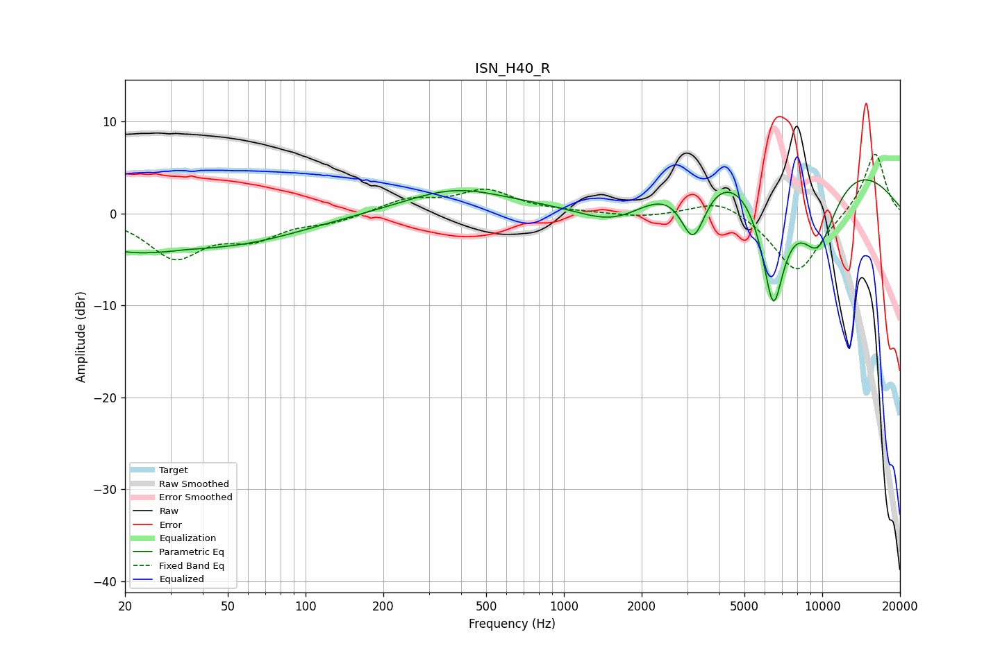

# ISN_H40_R
See [usage instructions](https://github.com/jaakkopasanen/AutoEq#usage) for more options and info.

### Parametric EQs
Apply preamp of -3.7 dB when using parametric equalizer.

|   # | Type    |   Fc (Hz) |    Q |   Gain (dB) |
|-----|---------|-----------|------|-------------|
|   1 | Peaking |        20 | 0.64 |        -3.3 |
|   2 | Peaking |        35 | 5.15 |         0.1 |
|   3 | Peaking |        57 | 0.54 |        -2.5 |
|   4 | Peaking |       377 | 0.72 |         2.6 |
|   5 | Peaking |      1604 | 0.9  |        -4.2 |
|   6 | Peaking |      3163 | 4.64 |         0.2 |
|   7 | Peaking |      3168 | 2.81 |        -7   |
|   8 | Peaking |      6461 | 2.56 |       -15   |
|   9 | Peaking |      6606 | 0.25 |         9.1 |
|  10 | Peaking |      9610 | 1.47 |        -9.5 |

### Fixed Band EQs
When using fixed band (also called graphic) equalizer, apply preamp of **-6.5 dB** (if available) and set gains manually with these parameters.

|   # | Type    |   Fc (Hz) |    Q |   Gain (dB) |
|-----|---------|-----------|------|-------------|
|   1 | Peaking |        31 | 1.41 |        -4.6 |
|   2 | Peaking |        62 | 1.41 |        -2.3 |
|   3 | Peaking |       125 | 1.41 |        -0.9 |
|   4 | Peaking |       250 | 1.41 |         1.5 |
|   5 | Peaking |       500 | 1.41 |         2.4 |
|   6 | Peaking |      1000 | 1.41 |         0.1 |
|   7 | Peaking |      2000 | 1.41 |        -0.4 |
|   8 | Peaking |      4000 | 1.41 |         1.7 |
|   9 | Peaking |      8000 | 1.41 |        -6.6 |
|  10 | Peaking |     16000 | 1.41 |         6.8 |

### Graphs

