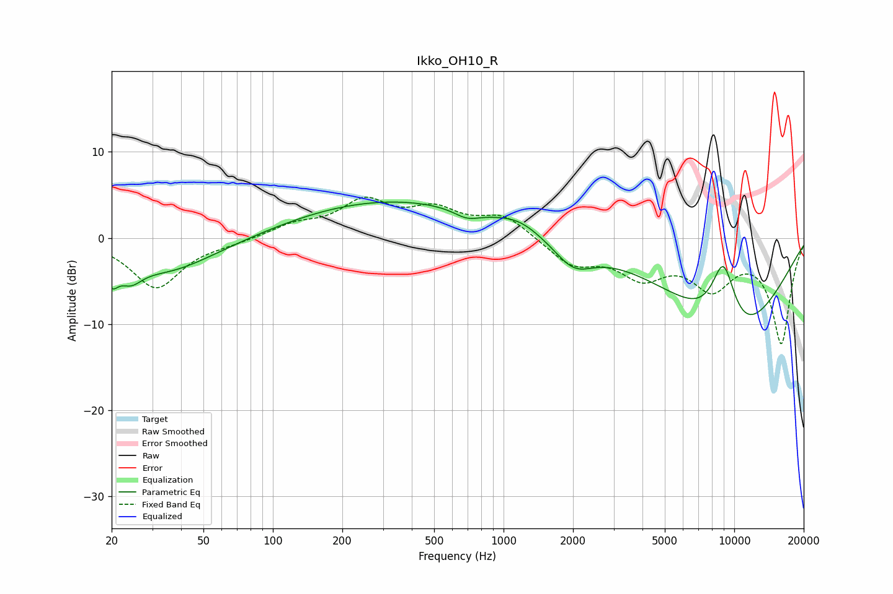

# Ikko_OH10_R
See [usage instructions](https://github.com/jaakkopasanen/AutoEq#usage) for more options and info.

### Parametric EQs
Apply preamp of -4.3 dB when using parametric equalizer.

|   # | Type    |   Fc (Hz) |    Q |   Gain (dB) |
|-----|---------|-----------|------|-------------|
|   1 | Peaking |        20 | 5.69 |        -2   |
|   2 | Peaking |        24 | 2.72 |        -2.2 |
|   3 | Peaking |        25 | 1.08 |         2.1 |
|   4 | Peaking |        29 | 0.61 |        -5.6 |
|   5 | Peaking |       330 | 0.32 |         4.4 |
|   6 | Peaking |       693 | 2.56 |        -1   |
|   7 | Peaking |      1166 | 1.56 |         1.1 |
|   8 | Peaking |      2011 | 1.66 |        -3   |
|   9 | Peaking |      8972 | 2.23 |         8.7 |
|  10 | Peaking |      9737 | 0.5  |       -12.2 |

### Fixed Band EQs
When using fixed band (also called graphic) equalizer, apply preamp of **-4.8 dB** (if available) and set gains manually with these parameters.

|   # | Type    |   Fc (Hz) |    Q |   Gain (dB) |
|-----|---------|-----------|------|-------------|
|   1 | Peaking |        31 | 1.41 |        -5.8 |
|   2 | Peaking |        62 | 1.41 |        -0.4 |
|   3 | Peaking |       125 | 1.41 |         1.4 |
|   4 | Peaking |       250 | 1.41 |         4   |
|   5 | Peaking |       500 | 1.41 |         2.9 |
|   6 | Peaking |      1000 | 1.41 |         2.5 |
|   7 | Peaking |      2000 | 1.41 |        -2.9 |
|   8 | Peaking |      4000 | 1.41 |        -3.9 |
|   9 | Peaking |      8000 | 1.41 |        -5.1 |
|  10 | Peaking |     16000 | 1.41 |       -12   |

### Graphs

