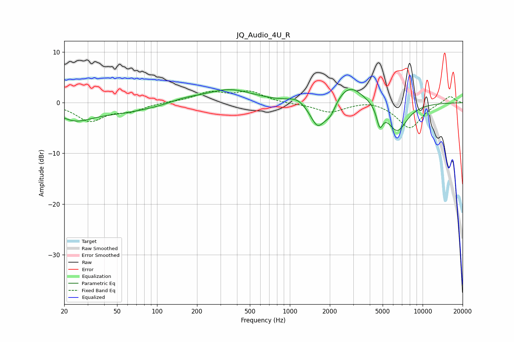

# JQ_Audio_4U_R
See [usage instructions](https://github.com/jaakkopasanen/AutoEq#usage) for more options and info.

### Parametric EQs
Apply preamp of -2.7 dB when using parametric equalizer.

|   # | Type    |   Fc (Hz) |    Q |   Gain (dB) |
|-----|---------|-----------|------|-------------|
|   1 | Peaking |        24 | 1.21 |        -2.2 |
|   2 | Peaking |        46 | 0.43 |        -1.9 |
|   3 | Peaking |       161 | 1.21 |         0.8 |
|   4 | Peaking |       350 | 0.79 |         2.6 |
|   5 | Peaking |      1132 | 2.27 |         1   |
|   6 | Peaking |      1621 | 2.44 |        -5.2 |
|   7 | Peaking |      2020 | 3.39 |        -2.5 |
|   8 | Peaking |      2802 | 1.31 |         3.9 |
|   9 | Peaking |      4755 | 6    |        -3.6 |
|  10 | Peaking |      6429 | 1.81 |        -5.7 |

### Fixed Band EQs
When using fixed band (also called graphic) equalizer, apply preamp of **-2.4 dB** (if available) and set gains manually with these parameters.

|   # | Type    |   Fc (Hz) |    Q |   Gain (dB) |
|-----|---------|-----------|------|-------------|
|   1 | Peaking |        31 | 1.41 |        -3.5 |
|   2 | Peaking |        62 | 1.41 |        -1.4 |
|   3 | Peaking |       125 | 1.41 |         0.2 |
|   4 | Peaking |       250 | 1.41 |         1.9 |
|   5 | Peaking |       500 | 1.41 |         2.1 |
|   6 | Peaking |      1000 | 1.41 |        -0.2 |
|   7 | Peaking |      2000 | 1.41 |        -1.9 |
|   8 | Peaking |      4000 | 1.41 |         0.6 |
|   9 | Peaking |      8000 | 1.41 |        -5   |
|  10 | Peaking |     16000 | 1.41 |         1.5 |

### Graphs

