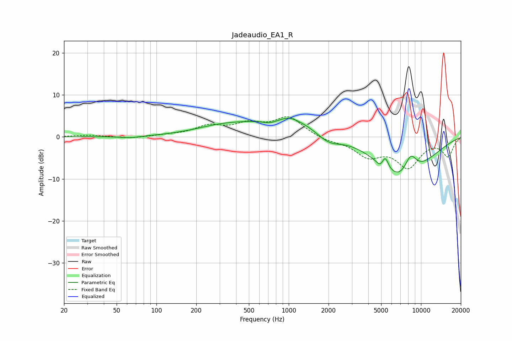

# Jadeaudio_EA1_R
See [usage instructions](https://github.com/jaakkopasanen/AutoEq#usage) for more options and info.

### Parametric EQs
Apply preamp of -4.5 dB when using parametric equalizer.

|   # | Type    |   Fc (Hz) |    Q |   Gain (dB) |
|-----|---------|-----------|------|-------------|
|   1 | Peaking |        64 | 2.01 |        -0.4 |
|   2 | Peaking |       309 | 0.67 |         1.8 |
|   3 | Peaking |       723 | 2.43 |        -0.9 |
|   4 | Peaking |      1017 | 2.17 |         0.9 |
|   5 | Peaking |      1152 | 0.43 |         4.6 |
|   6 | Peaking |      1993 | 1.36 |        -3.3 |
|   7 | Peaking |      4896 | 6    |        -1   |
|   8 | Peaking |      5375 | 6    |         2.6 |
|   9 | Peaking |      7310 | 0.68 |       -11.3 |
|  10 | Peaking |      8337 | 2.51 |         5.6 |

### Fixed Band EQs
When using fixed band (also called graphic) equalizer, apply preamp of **-4.9 dB** (if available) and set gains manually with these parameters.

|   # | Type    |   Fc (Hz) |    Q |   Gain (dB) |
|-----|---------|-----------|------|-------------|
|   1 | Peaking |        31 | 1.41 |         0.4 |
|   2 | Peaking |        62 | 1.41 |        -0.4 |
|   3 | Peaking |       125 | 1.41 |         0.3 |
|   4 | Peaking |       250 | 1.41 |         2.3 |
|   5 | Peaking |       500 | 1.41 |         2.6 |
|   6 | Peaking |      1000 | 1.41 |         4.5 |
|   7 | Peaking |      2000 | 1.41 |        -0.9 |
|   8 | Peaking |      4000 | 1.41 |        -4.2 |
|   9 | Peaking |      8000 | 1.41 |        -6.8 |
|  10 | Peaking |     16000 | 1.41 |        -4.4 |

### Graphs

