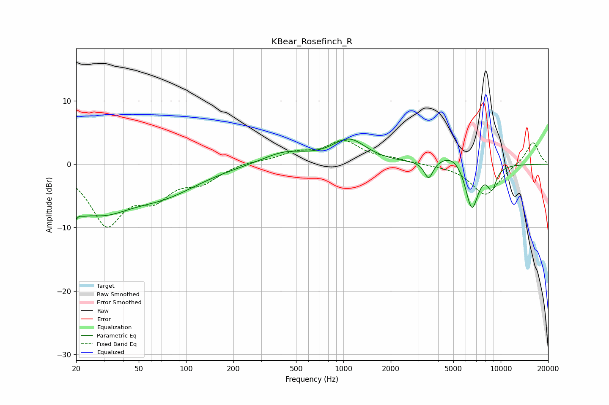

# KBear_Rosefinch_R
See [usage instructions](https://github.com/jaakkopasanen/AutoEq#usage) for more options and info.

### Parametric EQs
Apply preamp of -4.1 dB when using parametric equalizer.

|   # | Type    |   Fc (Hz) |    Q |   Gain (dB) |
|-----|---------|-----------|------|-------------|
|   1 | Peaking |        20 | 3.92 |        -6.1 |
|   2 | Peaking |        21 | 5.61 |         3.3 |
|   3 | Peaking |        28 | 0.71 |        -6.3 |
|   4 | Peaking |        73 | 0.62 |        -3.7 |
|   5 | Peaking |       424 | 0.99 |         1.9 |
|   6 | Peaking |      1087 | 1.3  |         3.7 |
|   7 | Peaking |      3482 | 5.08 |        -2.8 |
|   8 | Peaking |      5020 | 1.58 |         2.1 |
|   9 | Peaking |      6545 | 3.19 |        -7.6 |
|  10 | Peaking |      8793 | 4.56 |        -3.3 |

### Fixed Band EQs
When using fixed band (also called graphic) equalizer, apply preamp of **-3.9 dB** (if available) and set gains manually with these parameters.

|   # | Type    |   Fc (Hz) |    Q |   Gain (dB) |
|-----|---------|-----------|------|-------------|
|   1 | Peaking |        31 | 1.41 |        -9   |
|   2 | Peaking |        62 | 1.41 |        -4.3 |
|   3 | Peaking |       125 | 1.41 |        -2.4 |
|   4 | Peaking |       250 | 1.41 |         0.4 |
|   5 | Peaking |       500 | 1.41 |         1.6 |
|   6 | Peaking |      1000 | 1.41 |         3.4 |
|   7 | Peaking |      2000 | 1.41 |         0.6 |
|   8 | Peaking |      4000 | 1.41 |        -0.1 |
|   9 | Peaking |      8000 | 1.41 |        -4.9 |
|  10 | Peaking |     16000 | 1.41 |         3.6 |

### Graphs

