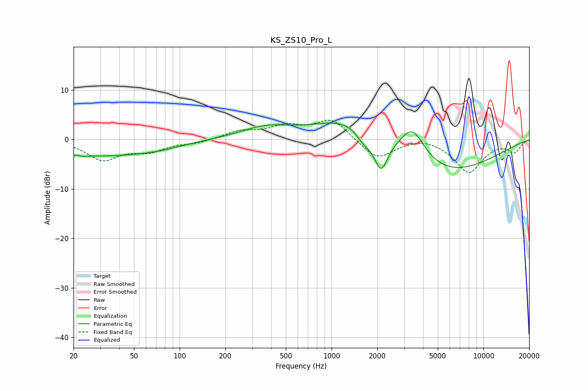

# KS_ZS10_Pro_L
See [usage instructions](https://github.com/jaakkopasanen/AutoEq#usage) for more options and info.

### Parametric EQs
Apply preamp of -3.4 dB when using parametric equalizer.

|   # | Type    |   Fc (Hz) |    Q |   Gain (dB) |
|-----|---------|-----------|------|-------------|
|   1 | Peaking |        20 | 3.9  |        -2.9 |
|   2 | Peaking |        20 | 5.81 |         2.3 |
|   3 | Peaking |        31 | 0.45 |        -3   |
|   4 | Peaking |        73 | 0.87 |        -0.8 |
|   5 | Peaking |       366 | 0.84 |         2.2 |
|   6 | Peaking |      1413 | 0.6  |         5.7 |
|   7 | Peaking |      1635 | 2.64 |        -2.4 |
|   8 | Peaking |      2117 | 3.06 |        -6.9 |
|   9 | Peaking |      3415 | 1.71 |         6.6 |
|  10 | Peaking |      5098 | 0.39 |        -7.5 |

### Fixed Band EQs
When using fixed band (also called graphic) equalizer, apply preamp of **-4.0 dB** (if available) and set gains manually with these parameters.

|   # | Type    |   Fc (Hz) |    Q |   Gain (dB) |
|-----|---------|-----------|------|-------------|
|   1 | Peaking |        31 | 1.41 |        -3.9 |
|   2 | Peaking |        62 | 1.41 |        -2.1 |
|   3 | Peaking |       125 | 1.41 |        -0.7 |
|   4 | Peaking |       250 | 1.41 |         1.5 |
|   5 | Peaking |       500 | 1.41 |         2.3 |
|   6 | Peaking |      1000 | 1.41 |         4.1 |
|   7 | Peaking |      2000 | 1.41 |        -4.1 |
|   8 | Peaking |      4000 | 1.41 |         0.8 |
|   9 | Peaking |      8000 | 1.41 |        -6.6 |
|  10 | Peaking |     16000 | 1.41 |        -2.4 |

### Graphs

