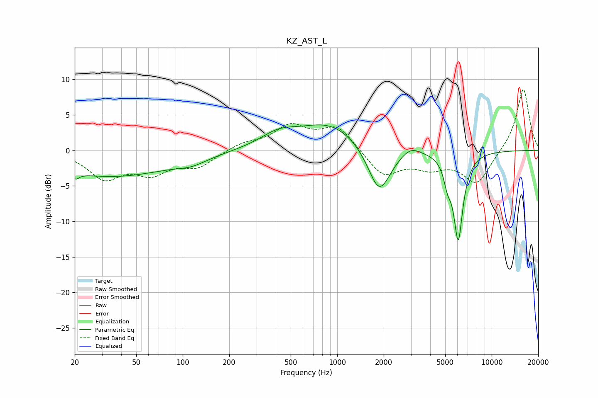

# KZ_AST_L
See [usage instructions](https://github.com/jaakkopasanen/AutoEq#usage) for more options and info.

### Parametric EQs
Apply preamp of -3.7 dB when using parametric equalizer.

|   # | Type    |   Fc (Hz) |    Q |   Gain (dB) |
|-----|---------|-----------|------|-------------|
|   1 | Peaking |        20 | 5.94 |        -3.6 |
|   2 | Peaking |        21 | 6    |         2.7 |
|   3 | Peaking |        34 | 0.36 |        -3.6 |
|   4 | Peaking |       114 | 1.47 |        -0.8 |
|   5 | Peaking |       416 | 1.18 |         1.8 |
|   6 | Peaking |       904 | 0.7  |         3.8 |
|   7 | Peaking |      1871 | 1.88 |        -6.9 |
|   8 | Peaking |      2984 | 2.33 |         1.2 |
|   9 | Peaking |      5176 | 5.95 |        -2.4 |
|  10 | Peaking |      6074 | 4.36 |       -12.3 |

### Fixed Band EQs
When using fixed band (also called graphic) equalizer, apply preamp of **-8.6 dB** (if available) and set gains manually with these parameters.

|   # | Type    |   Fc (Hz) |    Q |   Gain (dB) |
|-----|---------|-----------|------|-------------|
|   1 | Peaking |        31 | 1.41 |        -3.7 |
|   2 | Peaking |        62 | 1.41 |        -2.8 |
|   3 | Peaking |       125 | 1.41 |        -2.1 |
|   4 | Peaking |       250 | 1.41 |         0.9 |
|   5 | Peaking |       500 | 1.41 |         3.2 |
|   6 | Peaking |      1000 | 1.41 |         3.3 |
|   7 | Peaking |      2000 | 1.41 |        -3.6 |
|   8 | Peaking |      4000 | 1.41 |        -2   |
|   9 | Peaking |      8000 | 1.41 |        -4.6 |
|  10 | Peaking |     16000 | 1.41 |         8.8 |

### Graphs

