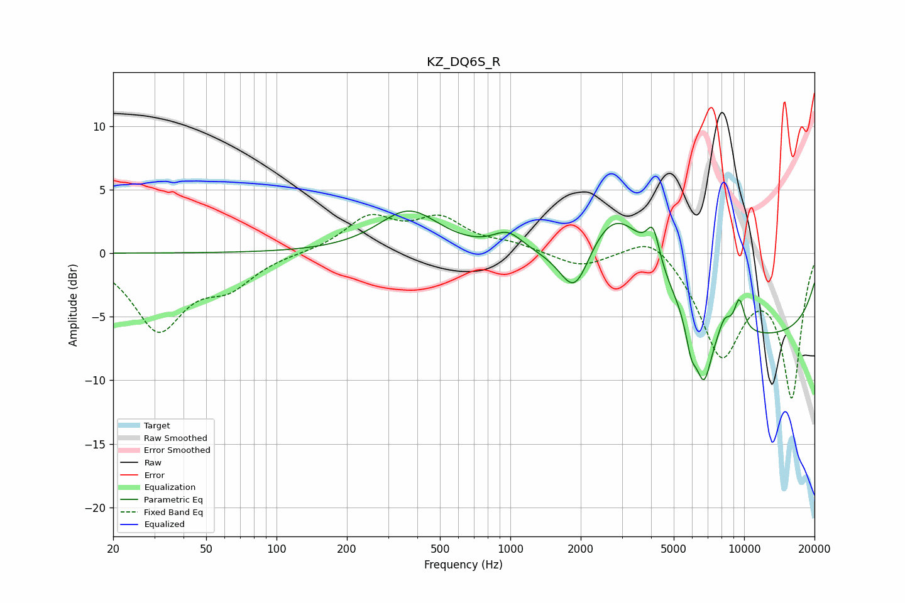

# KZ_DQ6S_R
See [usage instructions](https://github.com/jaakkopasanen/AutoEq#usage) for more options and info.

### Parametric EQs
Apply preamp of -3.4 dB when using parametric equalizer.

|   # | Type    |   Fc (Hz) |    Q |   Gain (dB) |
|-----|---------|-----------|------|-------------|
|   1 | Peaking |       368 | 1.08 |         3.3 |
|   2 | Peaking |       977 | 2.16 |         1.5 |
|   3 | Peaking |      1890 | 2.15 |        -4.2 |
|   4 | Peaking |      2859 | 0.89 |         7.5 |
|   5 | Peaking |      4082 | 4.98 |         2.9 |
|   6 | Peaking |      5935 | 5.83 |        -2.3 |
|   7 | Peaking |      6728 | 3.83 |        -4.9 |
|   8 | Peaking |      8245 | 5.47 |         1.2 |
|   9 | Peaking |      9534 | 5.71 |         2.6 |
|  10 | Peaking |     10000 | 0.18 |        -6.7 |

### Fixed Band EQs
When using fixed band (also called graphic) equalizer, apply preamp of **-3.1 dB** (if available) and set gains manually with these parameters.

|   # | Type    |   Fc (Hz) |    Q |   Gain (dB) |
|-----|---------|-----------|------|-------------|
|   1 | Peaking |        31 | 1.41 |        -5.8 |
|   2 | Peaking |        62 | 1.41 |        -2.2 |
|   3 | Peaking |       125 | 1.41 |         0   |
|   4 | Peaking |       250 | 1.41 |         2.7 |
|   5 | Peaking |       500 | 1.41 |         2.5 |
|   6 | Peaking |      1000 | 1.41 |         0.6 |
|   7 | Peaking |      2000 | 1.41 |        -1.1 |
|   8 | Peaking |      4000 | 1.41 |         1.9 |
|   9 | Peaking |      8000 | 1.41 |        -7.8 |
|  10 | Peaking |     16000 | 1.41 |       -11.1 |

### Graphs

