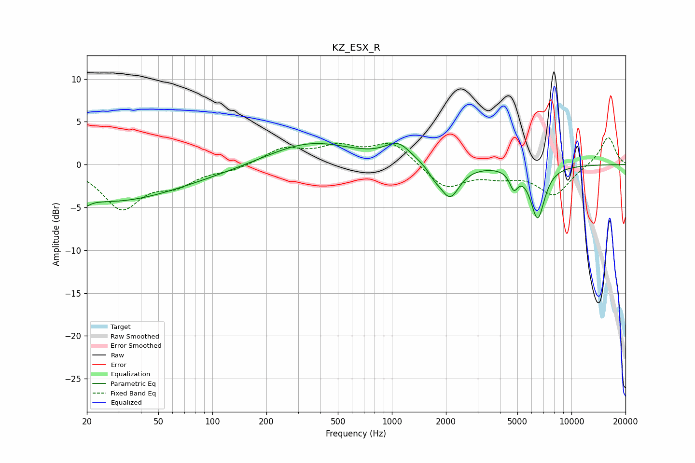

# KZ_ESX_R
See [usage instructions](https://github.com/jaakkopasanen/AutoEq#usage) for more options and info.

### Parametric EQs
Apply preamp of -2.6 dB when using parametric equalizer.

|   # | Type    |   Fc (Hz) |    Q |   Gain (dB) |
|-----|---------|-----------|------|-------------|
|   1 | Peaking |        20 | 5.72 |        -3.8 |
|   2 | Peaking |        20 | 6    |         3   |
|   3 | Peaking |        25 | 0.4  |        -4   |
|   4 | Peaking |        81 | 0.44 |        -0.8 |
|   5 | Peaking |       352 | 0.59 |         2.7 |
|   6 | Peaking |      1084 | 1.94 |         2   |
|   7 | Peaking |      1724 | 4.16 |        -0.8 |
|   8 | Peaking |      2101 | 2.57 |        -3.9 |
|   9 | Peaking |      4775 | 6    |        -2   |
|  10 | Peaking |      6482 | 3.46 |        -6.1 |

### Fixed Band EQs
When using fixed band (also called graphic) equalizer, apply preamp of **-3.2 dB** (if available) and set gains manually with these parameters.

|   # | Type    |   Fc (Hz) |    Q |   Gain (dB) |
|-----|---------|-----------|------|-------------|
|   1 | Peaking |        31 | 1.41 |        -4.9 |
|   2 | Peaking |        62 | 1.41 |        -2   |
|   3 | Peaking |       125 | 1.41 |        -0.6 |
|   4 | Peaking |       250 | 1.41 |         1.8 |
|   5 | Peaking |       500 | 1.41 |         1.8 |
|   6 | Peaking |      1000 | 1.41 |         2.6 |
|   7 | Peaking |      2000 | 1.41 |        -2.8 |
|   8 | Peaking |      4000 | 1.41 |        -1.1 |
|   9 | Peaking |      8000 | 1.41 |        -3.5 |
|  10 | Peaking |     16000 | 1.41 |         3.3 |

### Graphs

