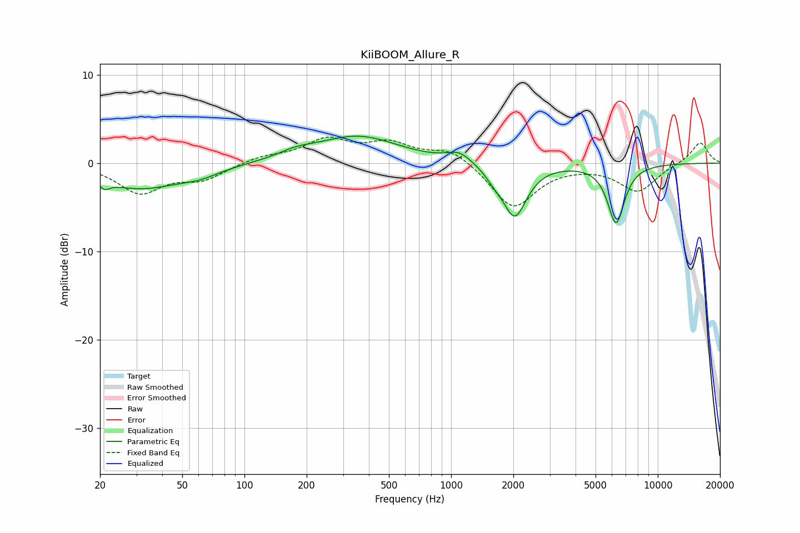

# KiiBOOM_Allure_R
See [usage instructions](https://github.com/jaakkopasanen/AutoEq#usage) for more options and info.

### Parametric EQs
Apply preamp of -3.1 dB when using parametric equalizer.

|   # | Type    |   Fc (Hz) |    Q |   Gain (dB) |
|-----|---------|-----------|------|-------------|
|   1 | Peaking |        21 | 5.94 |        -2.9 |
|   2 | Peaking |        21 | 6    |         2.1 |
|   3 | Peaking |        31 | 0.69 |        -2.8 |
|   4 | Peaking |        61 | 1.49 |        -0.7 |
|   5 | Peaking |       178 | 1.65 |         0.7 |
|   6 | Peaking |       352 | 0.72 |         3   |
|   7 | Peaking |      1096 | 2.42 |         1.2 |
|   8 | Peaking |      1616 | 3.39 |        -0.9 |
|   9 | Peaking |      2032 | 2.45 |        -6   |
|  10 | Peaking |      6280 | 3.37 |        -6.7 |

### Fixed Band EQs
When using fixed band (also called graphic) equalizer, apply preamp of **-3.0 dB** (if available) and set gains manually with these parameters.

|   # | Type    |   Fc (Hz) |    Q |   Gain (dB) |
|-----|---------|-----------|------|-------------|
|   1 | Peaking |        31 | 1.41 |        -3.3 |
|   2 | Peaking |        62 | 1.41 |        -1.7 |
|   3 | Peaking |       125 | 1.41 |         0.7 |
|   4 | Peaking |       250 | 1.41 |         2.5 |
|   5 | Peaking |       500 | 1.41 |         2   |
|   6 | Peaking |      1000 | 1.41 |         1.7 |
|   7 | Peaking |      2000 | 1.41 |        -5.1 |
|   8 | Peaking |      4000 | 1.41 |        -0.1 |
|   9 | Peaking |      8000 | 1.41 |        -3.2 |
|  10 | Peaking |     16000 | 1.41 |         2.4 |

### Graphs

