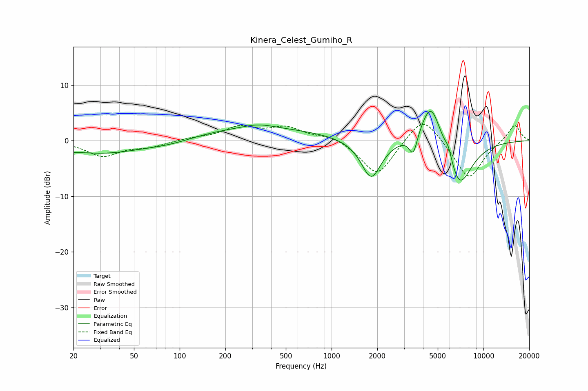

# Kinera_Celest_Gumiho_R
See [usage instructions](https://github.com/jaakkopasanen/AutoEq#usage) for more options and info.

### Parametric EQs
Apply preamp of -5.4 dB when using parametric equalizer.

|   # | Type    |   Fc (Hz) |    Q |   Gain (dB) |
|-----|---------|-----------|------|-------------|
|   1 | Peaking |        20 | 4.37 |        -0.3 |
|   2 | Peaking |        31 | 0.52 |        -2.3 |
|   3 | Peaking |        89 | 0.82 |        -1.1 |
|   4 | Peaking |       296 | 0.29 |         2.3 |
|   5 | Peaking |       330 | 1.46 |         0.7 |
|   6 | Peaking |      1823 | 2.12 |        -7.2 |
|   7 | Peaking |      3452 | 5.1  |        -3.9 |
|   8 | Peaking |      4516 | 1.98 |         8.5 |
|   9 | Peaking |      5883 | 5.69 |         1.9 |
|  10 | Peaking |      6918 | 1.59 |        -9   |

### Fixed Band EQs
When using fixed band (also called graphic) equalizer, apply preamp of **-3.0 dB** (if available) and set gains manually with these parameters.

|   # | Type    |   Fc (Hz) |    Q |   Gain (dB) |
|-----|---------|-----------|------|-------------|
|   1 | Peaking |        31 | 1.41 |        -2.7 |
|   2 | Peaking |        62 | 1.41 |        -1   |
|   3 | Peaking |       125 | 1.41 |         0.4 |
|   4 | Peaking |       250 | 1.41 |         2.3 |
|   5 | Peaking |       500 | 1.41 |         2.2 |
|   6 | Peaking |      1000 | 1.41 |         1   |
|   7 | Peaking |      2000 | 1.41 |        -6.5 |
|   8 | Peaking |      4000 | 1.41 |         5.1 |
|   9 | Peaking |      8000 | 1.41 |        -7.1 |
|  10 | Peaking |     16000 | 1.41 |         3.1 |

### Graphs

