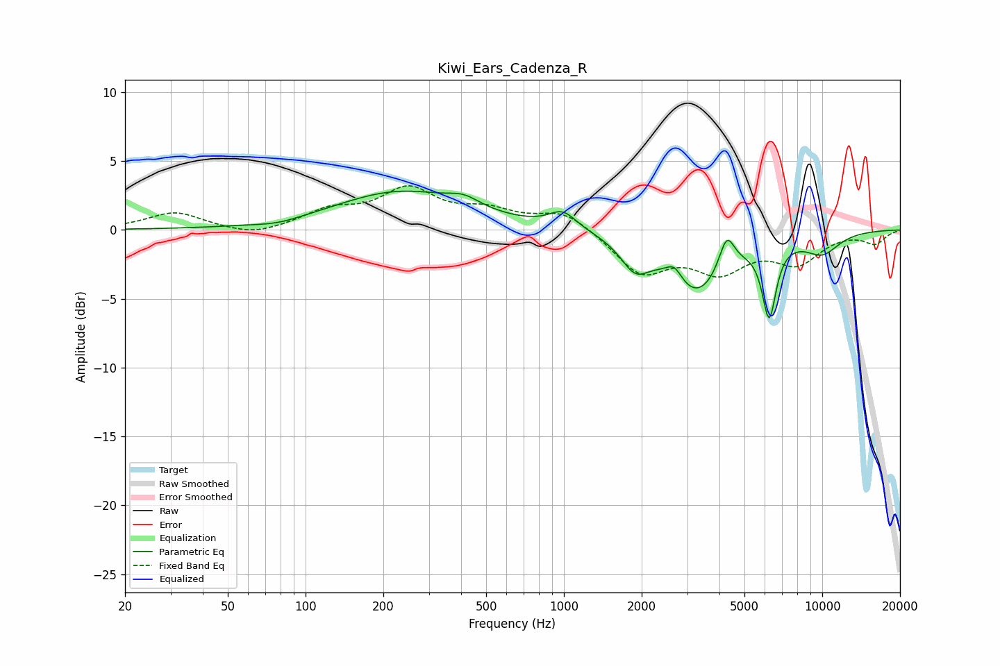

# Kiwi_Ears_Cadenza_R
See [usage instructions](https://github.com/jaakkopasanen/AutoEq#usage) for more options and info.

### Parametric EQs
Apply preamp of -2.9 dB when using parametric equalizer.

|   # | Type    |   Fc (Hz) |    Q |   Gain (dB) |
|-----|---------|-----------|------|-------------|
|   1 | Peaking |        78 | 1.55 |        -0.3 |
|   2 | Peaking |       233 | 0.57 |         2.7 |
|   3 | Peaking |       410 | 2.3  |         0.7 |
|   4 | Peaking |       991 | 2.66 |         1.2 |
|   5 | Peaking |      1885 | 2.55 |        -2.1 |
|   6 | Peaking |      2676 | 4.63 |         1.1 |
|   7 | Peaking |      3267 | 1.26 |        -4.5 |
|   8 | Peaking |      4267 | 4.65 |         2.5 |
|   9 | Peaking |      6232 | 5.13 |        -5.3 |
|  10 | Peaking |     10000 | 1.79 |        -1.5 |

### Fixed Band EQs
When using fixed band (also called graphic) equalizer, apply preamp of **-3.3 dB** (if available) and set gains manually with these parameters.

|   # | Type    |   Fc (Hz) |    Q |   Gain (dB) |
|-----|---------|-----------|------|-------------|
|   1 | Peaking |        31 | 1.41 |         1.3 |
|   2 | Peaking |        62 | 1.41 |        -0.6 |
|   3 | Peaking |       125 | 1.41 |         1.3 |
|   4 | Peaking |       250 | 1.41 |         2.7 |
|   5 | Peaking |       500 | 1.41 |         1.2 |
|   6 | Peaking |      1000 | 1.41 |         1.4 |
|   7 | Peaking |      2000 | 1.41 |        -3   |
|   8 | Peaking |      4000 | 1.41 |        -2.6 |
|   9 | Peaking |      8000 | 1.41 |        -2.2 |
|  10 | Peaking |     16000 | 1.41 |        -0.9 |

### Graphs

